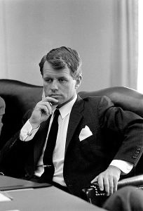

LBJ Library photo by Yoichi R. Okamoto

El 18 de marzo de 1968, [Robert Kennedy](http://es.wikipedia.org/wiki/Robert_F._Kennedy) en plena campaña y a pocas semanas que fuera asesinado hizo un discurso donde atacó la falsedad de que el PIB (el Producto Interior Bruto) es una medida de felicidad. Es un discurso muy famoso y lo encontraréis referenciado en muchos sitios, y este blog no será menos:

> *“Nuestro PIB tiene en cuenta, en sus cálculos, la contaminación atmosférica, la publicidad del tabaco y las ambulancias que van a recoger los heridos en nuestras autopistas. Registra los costes de los sistemas de seguridad que instalamos para proteger nuestros hogares y las cárceles en las que encerramos a los que logran irrumpir en ellos. Conlleva la destrucción de nuestros bosques de secuoyas y su sustitución por urbanizaciones caóticas y descontroladas. Incluye la producción de napalm, armas nucleares y vehículos blindados que utiliza nuestra policía antidisturbios para reprimir los estallidos de descontento urbano. Recoge (…) los programas de televisión que ensalzan la violencia con el fin de vender juguetes a los niños.*

> *En cambio, el PIB no refleja la salud de nuestros hijos, la calidad de nuestra educación, ni el grado de diversión de nuestros juegos. No mide la belleza de nuestra poesía, ni la solidez de nuestros matrimonios. No se preocupa de evaluar la calidad de nuestros debates políticos, ni la integridad de nuestros representantes. No toma en consideración nuestro valor, sabiduría o cultura. Nada dice de nuestra compasión ni de la dedicación a nuestro país. En una palabra: el PIB lo mide todo excepto lo que hace que valga la pena vivir la vida” –* Robert Kennedy, University of Kansas, Lawrence, Kansas

Lo lees y parece de sentido común pero abres cualquier periódico y entonces parece que todos estemos atentos a estos indicadores que como el PIB o otros alguien nos convenció que son la base de nuestra felicidad.