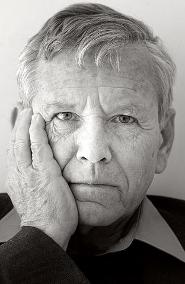

Tras una sobremesa reciente donde discutimos si aquellos personajes históricos considerados como malvados no habían sido conscientes de su maldad debido a que estaban dentro de una dinámica social, familiar, cultural etc que les transformaba su moralidad, hoy leí casualmente unos parágrafos del libro del “*Arte de la vida*” de [Bauman](http://es.wikipedia.org/wiki/Zygmunt_Bauman) que me parecieron idóneos y oportunos.

Bauman discute en el tercer capítulo de “*La Elección*” sobre la moralidad y cita el trabajo de [Nechema Tec](http://en.wikipedia.org/wiki/Nechama_Tec) llamado “[When Light Pierced the Darkness](http://www.oup.com/us/catalog/general/subject/HistoryWorld/European/OtherEuropeanNations/?view=usa&ci=9780195051940)” donde unas de las conclusiones más relevantes y que puso en evidencia a muchos sociólogos fue que “*no parecía haber un factor estadísticamente  significativo que determinase el comportamiento moral*” a la hora de esconder y proteger a los judíos en las ciudades polacas en plena ocupación nazi.

Y esto le servió a Bauman para introducir en el libro a [Amos Oz](http://es.wikipedia.org/wiki/Amos_Oz), un famoso escritor judío. Lo introduce con dos parágrafos muy significativos que expuso en su discurso de aceptación del premio Goethe de 2005.

Amos Oz, Foto de [Michiel Hendryckx](http://commons.wikimedia.org/wiki/User:Michiel_Hendryckx "User:Michiel Hendryckx") ([cc](http://creativecommons.org/licenses/by/3.0/deed.en))

El primer parágrafo en el libro del discurso de Amos Oz hace referencia en lo que se cree hoy en día:

> *Todos los motivos y acciones humanos derivan de las circunstancias, que a menudo superan el control personal. \[…\] Estamos controlados por nuestro antecedentes sociales. Hace ya más de cien años que nos dicen que nos motiva exclusivamente el interés económico propio, que somos meros productos de nuestras culturas étnicas, no somo más que marionetas de nuestro subconsciente.*

y el siguiente parágrafo que pone Bauman es aquel donde Amos Oz desacredita lo dicho anteriormente:

> *Personalmente, creo que todo ser humano, en el fondo de su corazón, es capaz de distinguir el bien del mal \[…\] A veces puede ser difícil definir el bien, pero el mal tiene un aroma inconfudible: hasta un niño sabe qué es el dolor a otra persona, sabemos qué estamos haciendo. Hacemos el mal.*

Doy toda la razón a Amos Oz, hay personas malas y personas buenas (quizá más bien una mezcla con infinidad de grados entre ambos). Pero al final, la responsabilidad recae en el individuo totalmente consciente de sus decisiones y consecuencias morales.

Me gustó tanto estos dos parágrafos que miré de buscar el discurso de Amos Oz. Obviamente lo encontré rápido con internet, aquí tenéis un link a una versión original: [http://adamash.blogspot.com.es/2005/09/amos-oz-god-satan-and-human.html](http://adamash.blogspot.com.es/2005/09/amos-oz-god-satan-and-human.html) y podéis encontrar una traducción al castellano en la edición del El País de 1 Oct de 2005 en el artículo [El mal tiene un olor inconfunduble](http://elpais.com/diario/2005/10/01/babelia/1128123563_850215.html), aunque es una versión reducida al no contener los primeros parágrafos del original :(.

Es un discurso muy interesante. Quizá sorprende la cantidad de figuras literarias, fantásticas y religiosas que aparecen pero es de un sentido común y humano aplastante. Y con un poco de paciencia se entiende: en los últimos tiempos siempre nos han hecho creer que la culpa de los males es de los políticos, los religiosos, los banqueros, los ciudadanos, los economistas, los integristas…. y así una larga lista de grupos sociales. Pero no, el mal y (el bien) está dentro de cada uno y cada uno de nosotros somos amos y señores de administrarlo. No nos engañemos, los individuos nos escondemos rápidamente en las masas cuando nos interesa.

También, recientemente escuché creo que en un debate por la radio aunque no recuerdo muy bien, que uno de los aciertos de los juicios de Nuremberg fue que se señaló y se culpó a las personas individuales y responsables de los crímenes acontecidos en la Alemania nazi, pero nunca se culpó al pueblo alemán.

Por último me entusiasmó ver como Amos Oz hace constante referencia a la figura de Fausto. Una interpretación de este personaje y su leyenda la podéis disfrutar en uno de los clásicos más clásicos del cine, el Fausto de F. W. Murnau que lo podéis ver directamente aquí: [http://www.youtube.com/watch?v=QBo\_CeldssI](http://www.youtube.com/watch?v=QBo_CeldssI)