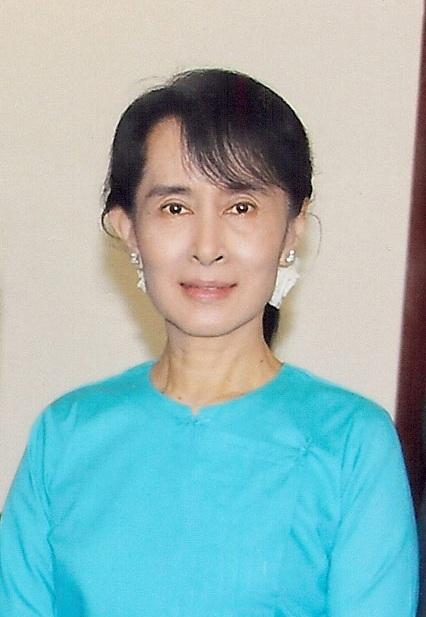

Aung Sun Suu Kyi – World Economic Forum [(cc)](http://commons.wikimedia.org/wiki/File:Aung_San_Suu_Kyi.jpg?uselang=es)

Acabo de leer el libro “[Cartas desde Birmania](http://www.casadellibro.com/libro-cartas-desde-birmania/9788477651574/634344)” de [Aung San Suu Kyi](http://es.wikipedia.org/wiki/Aung_San_Suu_Kyi). Gracias Meritxell por prestarme esta preciosa obra.  Aung San Suu Kyi  es la activista política que durante años ha estado luchando en pro a la instauración de la democracia en Birmania y recopila en este libro toda una serie de cartas que durante un año envió al periódico japonés [Mainichi Shinbun](http://mainichi.jp/english/english/). El año en que comenzó este proyecto fue 1995 y fue prácticamente el único periodo de tiempo que pudo estar fuera del régimen de arresto domiciliario en el que ha estado de 1989 hasta 2010.

El libro compuesto por una cincuentena de pequeñas cartas habla, como ella misma afirma en el último capítulo, de diversos amigos y colegas suyos, de las actividades de su partido [NLD](http://www.nldburma.org/), sobre los presos políticos pero también sobre las fiestas tradicionales y las ceremonias budistas en Birmania. En definitiva es un libro sobre lo cotidiano pero desde toda una figura de nuestros tiempos que no ha dejado de luchar por la libertad en su país oprimido por la dictadura.

Antes de presentaros aquellas cosas que me han parecido más interesantes en el libro, muchas de ellas relacionadas con su forma de afrontar la vida más que de las situaciones políticas, te recomiendo que leas una biografía bastante completa de Aung San Suu Kyi que te pondrá en contexto:

[http://www.biografiasyvidas.com/biografia/a/aung\_san\_suu.htm](http://www.biografiasyvidas.com/biografia/a/aung_san_suu.htm)

Vamos al grano. Tras leer a [Bauman](http://es.wikipedia.org/wiki/Zygmunt_Bauman) (lo siento lectores de mi blog que los últimos artículos he hecho constantes referencias a este sociólogo, no es que esté enamorado, tan solo es una causalidad) te das cuenta que Aung San Suu Kyi podría considerarse como una gran artista de la vida: genuina, firme y que va a dejar una obra en la humanidad importante.

Me ha sido difícil hacer un resumen para mi blog, es más, tengo una sensación que el resultado le falta un cierto ritmo para mantener la atención pero han podido más mis ganas de presentaros ya este artículo que el dedicar más tiempo a bordar la redacción. En definitiva, que sepáis que el mejor resumen es leer el libro (se muy lee rápido) y saquéis vuestras conclusiones.

Os comento, he optado por crear bloques de texto de aquellos temas que me han parecido más significativos encabezados por uno o varios conceptos que a mi modo de entender los resume. Al final tenéis una pequeña conclusión y enlaces de internet alrededor de lo que vamos a comentar.

**Madrugar**

Una de las primeras cosas interesantes del libro la encuentro en la referencia que realiza del alba.  Aung San Suu Kyi comenta como fue una constante para ella levantarse muy temprano durante uno de los períodos clave de su lucha, en la campaña electoral de 1988, y eso le conmovía y aún lo hace: “*esa sensación de que el mundo yace en calma, vulnerable, esperando ser despertado por la luz del nuevo día que palpita un poco más allá del horizonte*”.  Leyendo estas palabras me vino a la cabeza las palabras de Josep Guardiola en la aceptación de la medalla de oro de la Generalitat de Catalunya: “*Si nos levantamos bien temprano, pero bien temprano temprano temprano y nos ponemos a trabajar somos un país imparable*”

Salvando las diferencias entre ambos personajes, me parece interesante esta referencia a una energía especial que parece tener el cuerpo cuando despierta bien temprano (siempre y cuando haya podido descansar) y que aquellos que la aprovechan acumulan una ventaja es sus vidas. ¿Madrugar, una clave para el artista de la vida?

**Bondad y Respeto**

Pero obviamente que toda la energía no solo la encontramos en el alba, Aung San Suu Kyi comenta que “*ningún proyecto puede se llevado a cabo con éxito sin la dadivosa cooperación de los interesados*” y aun más interesante “*la gente aporta de buena gana su sudor y su dinero cuando es tratada con bondad y respeto, y si está convencida que su contribución realmente beneficiará a alguien*”.

Como me gustan la palabras bondad y respeto porque esto implica escuchar, y escuchar es parte fundamental de la comunicación que a la vez es parte de nuestra ser social. Bondad, respeto, comunicación conceptos nucleares de las personas.

Y me gusta el hecho que Aung San Suu Kyi haga referencia a la necesidad que la persona esté convencido que su trabajo beneficiará para alguien, en definitiva que sirve para algo.  La persona busca dar sentido a la vida y es necesario que parte de este sentido lo encuentre en un tiempo y espacio que en muchos casos nos ocupa una gran parte de nuestra vida como son nuestros trabajos.

**Viaje**

Continúas leyendo las Cartas de Birmania y entras en la historia de este país, en su política, falta de justicia a partir de la década de los 90, tradiciones y creencias del país muy relacionadas con el budismo.

Por ejemplo te habla de la pagoda [Kyaik-ntiyoe](http://en.wikipedia.org/wiki/Kyaiktiyo_Pagoda)  que está en una posición tan delicada que basta que alguien la empuje para que se balancee o de las canciones dobat que me recuerdan a las chirigotas de Cádiz. Con estos textos viajamos a tierras lejanas y de tanto en tanto algún dicho birmano aparece, que más allá de ser ingenioso, es sencillo y elegante:

> “Diez mil pájaros pueden posarse en un buen árbol”

**Casualidad**

Otra tradición que nos dará a continuación de qué hablar con profundidad es la de Año Nuevo. A través de una anécdota en esta festividad en la cocina de una amiga suya, quién para Año Nuevo de 1986 cocinó unos [o-mochi](http://es.wikipedia.org/wiki/Mochi) que por desgracia quedaron quemados, Aung San Suu Kyi tuvo el acto de comérselos lo que le dió fuerzas para continuar todos los futuros viajes que tenía pendientes aquel año. Y no lo hizo porque unos cuantos o-mochi pueden darte las calorías suficientes  para soportar todos esos viajes, que obviamente no es así, sino porque alude a la *Ley de la Casualidad* universal, tal como lo entiende el budismo. Así nos lo indica la nota del traductor del libro, Juan Abeleiras. Esta ley nos indica que toda causa tiene su efecto y que cada pensamiento, palabra o acción revierte en beneficios o en perjuicio nuestro. Depende de nuestra intención. Por tanto ese gesto que tuvo nuestra protagonista en no dar asco a los o-mochi quemados se le revertió en fuerzas para aguantar el duro año que llegaba.

No se hasta qué punto la *Ley de la Casualidad* se puede comprobar de forma empírica pero lo que sí que me atrevo a decir es que detrás de esta ley se esconde la actitud. Y desde mi punto de vista la actitud es donde nacen tus acciones y por tanto será tu guía por tu camino singular de la vida. Apúntatelo si has llegado a leer hasta aquí este artículo que la actitud lo es prácticamente todo. No lo dudes.

**Descanso**

Dejando de una banda la casualidad nos volvemos a encontrar con otra fuente de fortaleza  de Aung San Suu Kyi. Ella nos habla en la carta *Días de descanso* del descanso  que suponía el fin de semana (cuando no aparecían compromisos de última hora) tras una semana muy intensa de trabajo. Los fines de semana no dejaba de levantarse temprano y meditar para posteriormente dejar fluir el día con los quehaceres domésticos. Pero lo que sí que encuentro especialmente interesante es como concluye la carta.  Aung San Suu Kyi explica que aquello que le da fuerzas para seguir luchando son los compañeros de trabajo y sobretodo el hecho de ver cada día aprovechado satisfactoriamente. Esto sí que es importante, finalizar el día y sentir que ha sido beneficioso. El buen artista revisa su obra diariamente.

**Gusto estético**

Otra cosa que Aung San Suu Kyi resalta como importante es el hecho de ser capaces de distinguir entre lo bonito y lo feo porque ello nos lleva a saber qué debemos aceptar y qué debemos rechazar. Aung San Suu Kyi se refiere a esta capacidad como la moral estética y nos la introduce en un capítulo a través de unas clases de la ceremonia del té que recibió en Oxford, ceremonia basada en el espíritu wakei seijaku: armonía (wa), respeto (kei), pureza (sei)  y sosiego (jaku).

**Humildad**

Y es que en las situaciones más cotidianas de Aung San Suu Kyi aparecen otras tantas ideas interesantes como la que comenta mientras arreglaba el tejado de su casa. Para ello tuvieron que reemplazar algunas decenas de tejas comprando nuevas en una tienda que vendía piezas de edificios derruidos. Pues bien, muchas de estas tejas que compraron de sustitución eran del siglo XIX y estaban intactas y robustas llegando a comentar “*los seres humanos, a menudo tan orgullosos de nuestras capacidades y nuestros logos, duramos menos tiempo que una simple teja*”. Y cuanta razón, parece una clara referencia a la falta de humildad ue tenemos en relación a nuestras existencias.

**Budismo**

Aung San Suu Kyi nos habla en otra de sus cartas de las lecturas  del [Man’yôshû](http://es.wikipedia.org/wiki/Man%27y%C5%8Dsh%C5%AB) (la recopilación más antigua existente de poemas japoneses)  que realizaba en una larga sesión fotográfica. En estas lecturas encuentra alimento mental y en el siguiente poema:

> *¿Con qué podría comparar este mundo?*

> *Con la blanca estela que dejó un barco*

> *Al que el alba vio irse bogando*

> *Lejos de su propia mente conceptual*

topa con un símil del momento que está viviendo en la sesión de fotos: ¿El por qué la obsesión de las personas en dejar constancia de las cosas? Aung San Suu Kyi no da una respuesta clara a la pregunta aunque llega a reconocer que en un país como el suyo sin libertad de expresión, es más que una bendición esta obsesión. Pero más interesante encuentro las notas del traductor que nos recuerda que este poema está marcado profundamente por la filosofía budista: la mente conceptual, el alba o mente del meditador, y el mundo irreal donde vivimos al que nos alejamos cuanto más cerca estamos de la Iluminación.  Estas referencias budistas que nos indieca el traductor no son casuales, Aung San Suu Kyi tiene como veréis ahora más adelante tiene una absoluta relación con el budismo.

Esta relación queda clara en la carta *Maestros* donde nos explica el Vassa o los retiros budistas que realizaba. En estos los monjes enseñan como caminar por lo que le llaman el *Noble Sendero Óctuple*:  recta palabra, recta acción, recto sustento, recto esfuerzo, recta atención, recta concentración, recto pensamiento, recta comprensión.

Esta carta es pozo de conocimiento budista. Primero nos recuerda de la importancia de la *samma-vaca* o palabra recta: decir palabras sinceras y beneficiosas a pesar de que sean dolorosas. Pero todavía más importante cultivar el *sati* o conciencia-abierta: ser plenamente consciente de cualquier pensamiento, palabra y actividad que uno realiza. Y para la cultivación del *sati* no hay nada mejor que la meditación. Aung San Suu Kyi nos comenta como en sus inicios del arresto domiciliaro comenzó a practicar la meditación con regularidad aunque los inicios fueron muy frustantes y tristes. Pero comenzó a superar estas dificultades tras la lectura del libro que le regaló su esposo “*In This Very Life: The Liberations Teaching of the Buddha*” del maestro [U Pandita](http://en.wikipedia.org/wiki/U_Pandita). Este libro le ayudó a llevar a la práctica los beneficios de la meditación y podéis encontrar una versión en línea aquí: [http://homepage.ntlworld.com/pesala/Pandita/](http://homepage.ntlworld.com/pesala/Pandita/)

¿Meditación, una posible herramienta para conocerse a si mismo, para ser genuino y desarrollar el artista que llevamos todos dentro?

**¿Qué opino del libro?**

Es una lectura muy recomendable para todos aquellos que quieren provocar un cambio profundo y no saben muy bien como. No parece existir grandes y transcendentales reflexiones, profundos conocimientos de la condición humana o discursos elaborados del sentido de la vida. Desde mi punto de vista solo hay una palabra que resume el por qué de la desaparición de tales artilugios: humildad. Las cartas se escriben desde la humildad y con belleza para cautivarnos con palabras tranquilas, sosegadas y mucho más cotidianas de lo que te puedes esperar.  Pero no nos engañemos, con reflexión esta lectura es intensa y esconde todo un personaje que ha sido referencia durante tres décadas en los cambios profundos en un país con una clara falta de derechos humanos. Un libro con el que puedes viajar a las tradiciones de ese país, a su cultura y gente. Un libro donde puedes conocer de primera mano las condiciones y dificultades (muchas veces de consecuencias dramáticas) de la lucha contra todo un sistema. Un libro donde puedes encontrar una puerta al budismo de cuyos conocimientos la autora bebe como fuente espiritual constantemente.

Es un libro con un sentido estético precioso y a la vez con un sentido ético elaborado: un gran libro.

La edición del libro que he tenido en mis manos es de CIRCE ediciones, 300 páginas en un pequeño formato muy cómodo. Se agradece también la traducción de Juan Abeleira quien aporta interesantísimos datos en sus respectivas notas del traductor.

**Enlaces**

Os dejo unos enlaces que os pueden servir si queréis investigar más sobre todo lo que rodea al personaje de Aung San Suu Kyi.

-   ***Letter from Burma***, [http://www.aappb.org/suukyi1.html#a](http://www.aappb.org/suukyi1.html#a), todas las cartas consultables en linia
-   ***A conversation with U Win Tin***, [http://www.mizzima.com/edop/interview/3405-a-conversation-with-u-win-tin.html](http://www.mizzima.com/edop/interview/3405-a-conversation-with-u-win-tin.html), una entrevista a uno de los colaboradores más próximos a la causa que defensa Aung San Suu Kyi
-   ***Aung San Suu Kyi interview, NDTV***: [http://www.ndtv.com/article/india/full-transcript-my-farewell-message-for-my-husband-was-too-late-says-aung-san-suu-kyi-to-ndtv-292831](http://www.ndtv.com/article/india/full-transcript-my-farewell-message-for-my-husband-was-too-late-says-aung-san-suu-kyi-to-ndtv-292831), transcripción de una de las entrevistas más recientes que he encontrado que se le hace a nuestra protagonista. En la entrevista se trata temas personales como fue la separación voluntaria de su familia, esposo e hijos por la causa por la que luchaba
-   ***Daw Aung San Suu Kyi’s pages***, [http://www.dassk.com](http://www.dassk.com/), página oficial de Daw Aung San Suu Kyi
-   ***2001 Waka for Japan 2001***, [http://www.temcauley.staff.shef.ac.uk/introduction.shtml](http://www.temcauley.staff.shef.ac.uk/introduction.shtml), traducciones de los poemas japonés del Man’yôsgû y otros
-   ***The Dhamma***, [http://www.thisismyanmar.com/nibbana/dhamma.htm](http://www.thisismyanmar.com/nibbana/dhamma.htm), recopilación de textos budistas