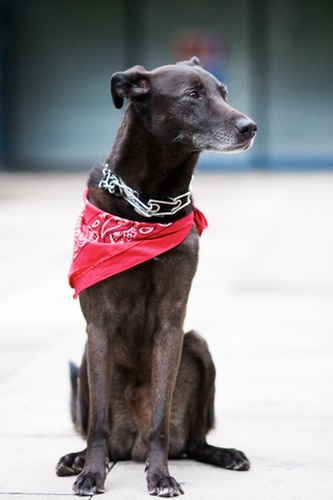

Dos interesantes reflexiones con el perro como protagonista que he encontrado leyendo el libro de [Robert Adams](http://en.wikipedia.org/wiki/Robert_Adams_\(photographer\)) “***Why People Photograph***“. Ambos fragmentos son del capítulo “Dogs”, donde comenta el por qué pueden ser un motivo los perros por el que la gente hace fotografías.

Primera referencia que os pongo, es una cita de Henry Beetle Hough que adjunta en el libro: 

> *“Un perro ama la vida como la ama un joven, siempre y siempre” (*Henry Beetle Hough)

Segunda,  como resumen del capítulo podemos leer en el último parágrafo :

> *“El arte depende de las emociones en la vida de su creador, y un artista debe encontrar caminos, como todo el mundo, de alimentarlas. Un fotógrafo que se arrodilla para sacar una foto a un perro ha encontrado el gozo suficiente para crear tantas cosas como sean posibles”*

**Extensión (21/abr/2013)**

Añado el link que Rosa nos deja en su comentario, un blog donde hay fotografías tomadas de perros en espacios públicos:

**WARTEHUNDE** – [http://wartehunde.tumblr.com](http://wartehunde.tumblr.com/)