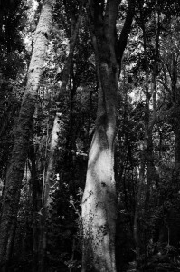
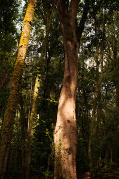
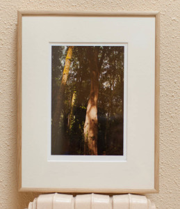

*(sin título)* – [Lluís Ribes i Portillo (cc)](http://creativecommons.org/licenses/by-nc-nd/2.0/) 

Garajonay, 2011 – [Lluís Ribes i Portillo (cc)](http://creativecommons.org/licenses/by-nc-nd/2.0/) 

Hoy se ha hecho entrega de una foto que he materializado y la que he nombrado sencillamente pero con gran cariño “*Garajonay, 2011*“. Es una bella instantanea tomada en el Parque Nacional de Garajonay el 28 de abril de 2011. Es la versión en color de una las fotografías que en estos momentos trabajo para un proyecto.

Me acuerdo aun del momento. Era de mañana y estaba subiendo desde el parking del camping que está en el límite del parque cerca del Cedro, hacia el Reventón Oscuro por uno de los senderos clásicos del parque. La niebla había desaparecido pero el bosque seguía brotando humedad y el cielo, lejos de estar despejado (y a unas pocas horas de caer un buen chaparrón) de tanto en tanto se abría permitiendo colarse a los rayos del sol. Cuando eso sucedía era como si estuvieras dentro de un pulmón gigante que de repente inspiraba la luz que iba agarrando más intensidad apareciendo gradualmente más sombras y luces por todas partes. Eran unos instantes de diez, veinte con suerte treinta segundos tras los cuales las nubes volvían a cubrir el sol y el bosque expiraba hacia una luz monótona y homogénea durante minutos.

En unos de estos momentos, delante de este árbol amigo que se elevaba al techo del bosque, no dude en tomarle una foto.

Descripción

-   “Garajonay, 2011” (#130001/#000001)

Todo el proceso desde la toma de la fotografía pasando por la edición e impresión han sido realizados por mi personalmente mimando la calidad de todo el proceso.

La primera copia de la fotografía se ha materializado en un cuadro con un marco de madera en un soporte de aluminio. El paspertú de ligero color crema nos transporta del marco a la foto, esta vez dejando un pequeño margen más ancho en su pie donde está el título de la foto y la firma.

La fotografía (12 cm x 18 cm) está impresa en un papel baritado de alta calidad con un gramaje de 310g/m2 usando tintas que permiten una longetividad del color de más de 70 años.

Garajonay, 2011 – [Lluís Ribes i Portillo (cc)](http://creativecommons.org/licenses/by-nc-nd/2.0/)