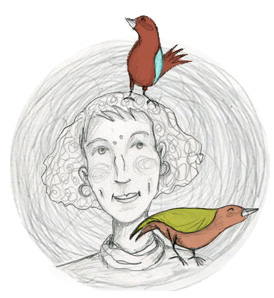
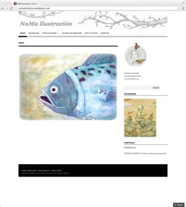

*[NuMa Ilustración](http://numailustracion.wordpress.com/ "Home") · © Núria Mareca* 

Núria Mareca ya tiene un pequeño espacio en la web donde podéis ver algunas de sus ilustraciones y sus trabajos: [NuMa Ilustración](http://numailustracion.wordpress.com/). Siempre con libreta y lápiz en mano lleva años dibujando su mundo particular en el lienzo de la libreta. Esta es Núria Mareca:

> 
> 
> *[NuMa Ilustración](http://numailustracion.wordpress.com/ "Home") · © Núria Mareca*
> 
> *“Hace tiempo, Núria decidió hacerse geóloga para descubrirlo todo sobre el origen del planeta y de sus antiguos habitantes. Mientras tanto, solía dibujar en sus ratos libres.*

> *Tantas historias sobre montañas que se mueven y fósiles de animales gigantescos que ya no existen, la obligaban continuamente a poner en marcha su imaginación. Estuvo tanto tiempo viviendo en un mundo imaginario que, al final, decidió quedarse en él. Para ello, un día se compró un traje de ilustradora. ¡Qué mejor excusa para vivir en un mundo imaginario que estar siempre rodeada de cuentos!.*

> *Actualmente reside en el Maresme y muchos dicen haberla visto allí, escondida entre pinceles, ilustrando cada nueva historia que cae en sus manos.” –* [Sobre Mí, NuMa Ilustración](http://numailustracion.wordpress.com/about/)

En la [galería de imágenes](http://numailustracion.wordpress.com/galeria-de-imagenes/) podéis ver trabajos suyos y en [sólo trazos](http://numailustracion.wordpress.com/solo-trazos/) algunos de los dibujos de sus famosas libretas.  
Si queréis contactar con ella: [numareca@yahoo.es](mailto:numareca@yahoo.es)

Felicitats per la web, Núria!