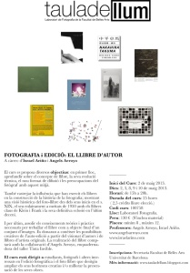

Si te gustan los libros de fotografía y te gusta también la encuadernación y quieres aprender los conceptos básicos de esta como es el trabajo con los cartones, la cola, la tela, los pliegues, el coser etc para hacerte un pequeño soporte para tus trabajos fotográficos puedes estar atento a los cursos de Israel Ariño y Àngels Arroyo realizan cada año [en la facultad de Bellas Artes: “*Fotografia i Edició: El llibre d’autor*“](http://tauladellum.blogspot.com.es/).  
Este año han sido cinco días, dos ellos dedicados a revisar libros de fotografía y tres a encuadernar.  La revisión de libros me pareció muy interesante. Israel pone a disposición de sus alumnos una mesa con una cantidad considerable de muy buenos libros de fotografía y si en las charlas que hay sobre estos no tienes suficiente para disfrutarlos puedes aprovechar el descanso o desconectar un momento y acabar de ver aquel libro que tanto te llama la atención.  
Este año pudimos disfrutar de libros como “*Infinito*” de David Giménez, dos de los libros de la trilogía de Enric Montes “*El Buscador de Prodigios*“, el clásico de “*The Americans*” de Robert Frank , el “*Mrs. Merryman’s Collection*” de Anne-Marie Merryman de la fantástica editora Mack, libros de Daido Moriyama y Masao Yamamoto, el “*Natura*” de Fontcuberta o el “*Censura*” de Julián Barón, un libro muy salvaje…, el “*William Eggleston’s Guide*” o el “*From Here to There: Alec Soth’s America* ” de Geoff Dyer de entre muchos otros.  
Personalmente me encantó esta parte dado que tambien era la materia del curso por la que estaba especialmente interesado. Pero no por ello pierde interés la parte de la encuadernación aunque aquí sufrí un poco. Cada día hicimos una pieza siguiendo las pautas que Àngels nos daba: el primer día una carpeta cuaderno, el segundo una agenda de viajes y el tercero un libro acordeón. Ciertamente el primer día pude comprobar como mis básicas nociones de manualidades que había adquirido unos años atrás las había digerido el tiempo y no pude seguir el ritmo de los jóvenes alumnos de bellas artes que plegaban las telas, encolaban y materializaban las creaciones con destreza, rapidez y delicadeza. Pero al final acabas y hasta parece mentira pero creas una pieza útil (la carpeta la estoy usando actualmente para guardar documentos del hogar) y espero que duradera. Los otros dos días, una vez puesto más a tono se disfrutan más, la agenda es preciosa y el libro de acordeón te da muchas ideas con las que trabajar tus fotografías.  
Para mi, como fotógrafo, el aprender a encuadernar no es tanto una técnica a dominar para acabar realizando tus portafolios o los libros de tus obras (que es una opción) sino el entrar en un mundo que será un soporte básico para tus fotos y por tanto una oportunidad imprescindible para tocar los materiales, conocer las posibilidades para acompañar tu obra así como para conocer artesanos de la encuadernación muy buenos, que todavía los hay, de tu ciudad. Por tanto, aunque no os vaya mucho las manualidades es una recomendación importante este curso para todos aquellos que quieran acompañar su obra de un soporte de calidad.  
Os dejo las webs de Israel y de Àngels para que tengáis más información de ellos:

[http://www.israelarino.com/](http://www.israelarino.com/)  
[http://www.angelsarroyo.es/](http://www.angelsarroyo.es/)