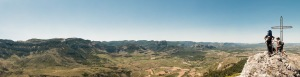
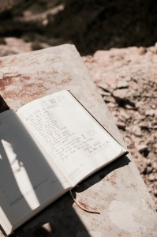

Panoràmica des del cim de Santa Bàrbara – [Lluís Ribes i Portillo (cc)](http://creativecommons.org/licenses/by-nc-nd/2.0/)

*“Allá está la cumbre.*

*¿Qué miras? Un astro.*

*¿Me amas? ¡Te adoro!*

*¿Subimos? ¡Subamos!*

*¿Qué ves? Una aurora*

*fugitiva y pálida.*

*¿Qué sientes? Anhelo.*

*Ésa es la esperanza.*

*¡Qué alientos de vida!*

*¡Qué fuegos de sol!*

*¡Qué luz tan radiante!*

*¡Ese es el amor!*

*¿Qué ves a tus plantas?*

*Un profundo abismo.*

*¿Tiemblas? Tengo miedo…*

*¡Ese es el olvido!*

*Pero no tiembles ni temas:*

*bajo el sacro cielo azul,*

*para el que ama no hay abismos,*

*porque tiene alas de luz.” – [Rubén Darío](http://es.wikipedia.org/wiki/Rub%C3%A9n_Dar%C3%ADo)*

Anotació al diari del cim.  
30 juny 2013  
Santa Bàrbara, Horta de Sant Joan  [Lluís Ribes i Portillo (cc)](http://creativecommons.org/licenses/by-nc-nd/2.0/)