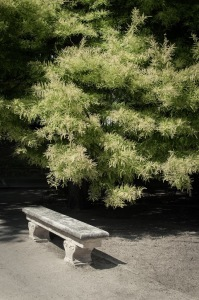

El Jardinet – [Lluís Ribes i Portillo (cc)](http://creativecommons.org/licenses/by-nc-nd/2.0/)

> *“\[..\] … Cuando una hora después encontré a su marido en la puerta del jardín, descubrí, justo antes que me tendiera la mano, una manchita de polvos en mi corbata. ¡Esa manchita de polvos! No apartaba la vista de ella y traté de sacudirla con una mano, mientras ponía apresuradamente la otra en la suya.”* 

> [Rainer Marie Rilke](http://ca.wikipedia.org/wiki/Rainer_Maria_Rilke)