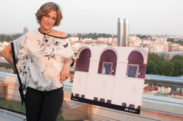

Por tercer año se celebra una exposición colectiva de la escuela EFTI en la azotea del Círculo de Bellas Artes de Madrid. “**Európolis, fotografía urbana en Europa**“es el título de la exposición y la podéis disfrutar hasta el 31 de julio de 2013. Para más información podéis [visitar el siguiente enlace](http://www.efti.es/agenda/europolis).

A la inauguración fui invitado por la fotógrafa [Monika Horstmann](http://www.efecuatro.es/monika-horstmann) de [Efecuatro](http://www.efecuatro.es/). Monika exponía su fotografía del patio interior de la Universidad de Zurich que fue una de las seleccionadas para la expo.

Si estáis en Madrid no dudéis en visitar esta exposición.

Monika Horstmann y su fotografía del patio interior de la Universidad de Zurich – [Lluís Ribes i Portillo (cc)](http://creativecommons.org/licenses/by-nc-nd/2.0/)