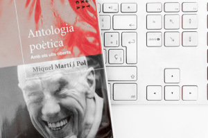

> “
> 
> …
> 
> Quan llegiu els meus llibres
> 
> hi trobareu la vostra pròpia veu,
> 
> la buidor elemental del vostre viure
> 
> que us omple les mans de vent.
> 
> …
> 
> “ *Quinze poemes – Miquel Martí i Pol*

Aquestes dos darreres setmanes m’ha caigut a les mans una antologia poètica de [Miquel Martí i Pol](http://ca.wikipedia.org/wiki/Miquel_Mart%C3%AD_i_Pol) (1929-2003) (l’Antologia poètica de Miquel Martí i Pol de Ricard Torrens d’edicions Proa). Martí i Pol és una dels poetes més populars de la poesia catalana que durant els seus primers vint anys com poeta la seva poesia pràcticament no es va fer ressò fins a partir dels anys 70 on la seva obra es va convertí en tot un fenòmen, sobretot popular, i a dia d’avui és sense dubte uns dels referents de la literatura catalana.

Aquesta antologia de Ricard Torrents ens inclou una petita introducció de la vida del poeta de Roda de Ter important per entendre la seva evolució literària. Miquel Martí i Pol va néixer a l’any 1929 d’una familia d’obrers, pràcticmament no va sortir del seu poble en tota la seva vida a on va estar-hi treballant sense parar a la fàbrica fins als anys 70 quan se li va diagnosticar l’enfermetat d’esclerosi múltiple. Fins aquell moment la seva producció literària, que no va ser poca, es va reduir als caps de semana a on a la tranquilitat de la seva llar trobava l’espai i el temps per dedicar a jugar-hi amb les paraules.  La seva enfermetat, el seu trancament amb la religió així com la mort de la seva esposa Dolors van ser punts d’inflexió importants a la seva vida que marcaren la seva obra.

No sóc un gran lector, menys de poesia però n’he trobat en alguns dels seus poemes la bellesa que constamente busco amb anhel.

Us deixo una llista dels poemes que més m’han agradat i que he trobat al llibre. També enllaço alguns poemes a webs on podreu llegir-los, en tot cas els trobareu a qualsevol llibreria o biblioteca.

-   **El poble** – *El poble (1966)* [http://marccandela.blogspot.com.es/2011/09/el-poble-miquel-marti-i-pol.html](http://marccandela.blogspot.com.es/2011/09/el-poble-miquel-marti-i-pol.html)
-   **Inventari del poble** – *El poble (1966)* [http://www.xtec.cat/~msimo1/textos/body/body\_m/marti\_pol/pol\_inventari\_poble.htm](http://www.xtec.cat/~msimo1/textos/body/body_m/marti_pol/pol_inventari_poble.htm)
-   **L’adolescent** – *Per preservar la veu (1985)*
-   **Sa Tuna** – *Temps d’interkuni (1990)*
-   **Si parlo dels teus ulls** – *Si esbrineu d’un sol gest (1976)* [http://www.xtec.cat/escolamiquelmartipolbdv/Miquel\_marti\_pol/htmiquel.htm](http://www.xtec.cat/escolamiquelmartipolbdv/Miquel_marti_pol/htmiquel.htm)
-   **Tarda** – *Autobiografia (1976)*
-   **Des de les hores mortes, talaiot** – *Estimada Marta (1976)* [http://www.sinera.org/mmp/mmp055a.htm](http://www.sinera.org/mmp/mmp055a.htm)
-   **L’amor** – *Llibre d’absències (1985)* [http://www.sinera.org/mmp/mmp148.htm](http://www.sinera.org/mmp/mmp148.htm)
-   **Si tornes** – *Temps d’interluni (1990)* [http://www.sinera.org/mmp/mmp102.htm](http://www.sinera.org/mmp/mmp102.htm)
-   **Aquells que no he estimat** – *Quinze poemes (1957)*
-   **No esperis cap señal enllà dels vidres** – *Primer llibre de Bloomsbury (1982)*

Per acabar uns quants enllaços d’interès:

-   [Una ruta literària amb poemes, comentaris del poeta, fotografies i poemes recitats](http://www.mapaliterari.cat/ca/mapa/guia/13/miquel/ruta-literaria-miquel-marti-i-pol)
-   [Biografia i poemes de molts dels seu llibres](http://www.mallorcaweb.com/Mag-Teatre/martipol/index.html)
-   [Una desena de poemes del poeta](http://lletra.uoc.edu/especials/folch/martipol.htm)
-   [Poemes versionats en cançons](http://www.musicadepoetes.cat/app/musicadepoetes/servlet/org.uoc.lletra.musicaDePoetes.Poeta?autor=145) 
-   [Una exposició virtual que combina pintures de varis artistas amb els poemes de Martí i Pol](http://www.sinera.org/mmp/index2.htm#dalt)