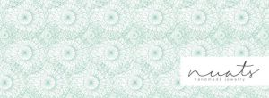
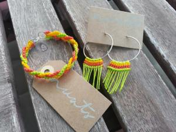
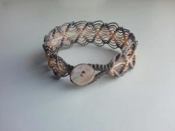
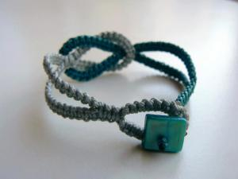
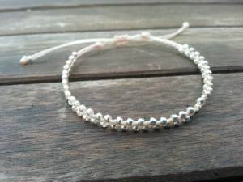
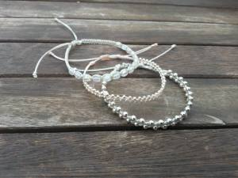
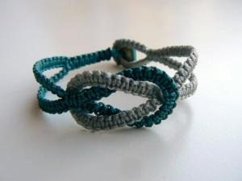
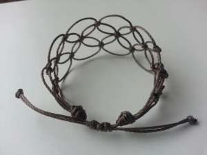
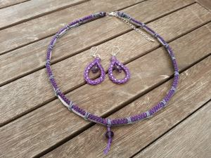
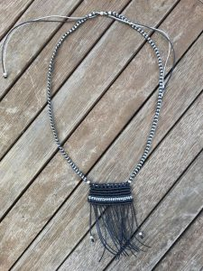

[nuats (c)](https://www.facebook.com/NuatsDesign/info)

[Nuats Handmade Jewelry](https://www.facebook.com/NuatsDesign) es una colección de complementos artesanales diseñada y fabricada en el corazón de Barcelona. Su primera temporada nos ofrece una buena variedad de pulseras, collares y pendientes tanto para chica como para chico.

Podéis seguir todas sus nuevas creaciones en su página [https://www.facebook.com/NuatsDesign](https://www.facebook.com/NuatsDesign). A día de hoy están preparando la tienda virtual pero de momento podéis pedir cualquier encargo contactando a través del correo electrónico:

 **[info.nuats@gmail.com](mailto:info.nuats@gmail.com)** 

[**www.facebook.com/NuatsDesign**](https://www.facebook.com/NuatsDesign)

Yo no pude resistirme a tener un *Nuats*. Encargué el modelo pulsera con una base de trapo elástica, una colección con más de una decena de colores disponibles del que escogí un azul que filtrea con el gris. Me encantó, sencilla, bonita y moderna.

A continuación os dejo unas fotografías que podéis encontrar en su web de algunos de sus modelos:

[nuats (c)](https://www.facebook.com/NuatsDesign/info)

[nuats (c)](https://www.facebook.com/NuatsDesign/info)

[nuats (c)](https://www.facebook.com/NuatsDesign/info)

[nuats (c)](https://www.facebook.com/NuatsDesign/info)

[nuats (c)](https://www.facebook.com/NuatsDesign/info)

[nuats (c)](https://www.facebook.com/NuatsDesign/info)

[nuats (c)](https://www.facebook.com/NuatsDesign/info)

[nuats (c)](https://www.facebook.com/NuatsDesign/info)