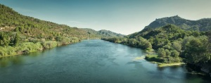
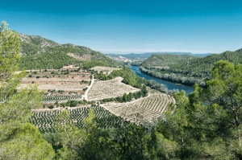
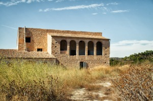
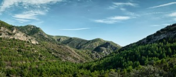

Primera Etapa, Travesía Benifallet Cambrils

Benifallet – Tivissa, [Recorrido wikiloc](http://ca.wikiloc.com/wikiloc/view.do?id=5771693)

**Distancia**: 34 km

**Duración**: salida a las 9:30 y llegada a las 18:00 a un ritmo tranquilo

[enlace al resumen de la travesía](http://www.lluisribes.net/?p=66) – [enlace a la segunda etapa](http://www.lluisribes.net/?p=62)

Río Ebro a su paso por el puente de Benifallet – [Lluís Ribes i Portillo (cc)](http://creativecommons.org/licenses/by-nc-nd/3.0/)

La primera etapa la comencé en Benifallet. Benifallet es una pequeña población situada en el río Ebro a 10 kilómetros de su desembocadura.  Se sitúa entre la falda de la Sierra de Cardó y el Ebro y es uno de los lugares de partida para hacer cayac por el río Ebro (muy recomendable). Aunque en realidad la etapa la comencé en [el albergue, que está en la antigua estación de tren](http://www.estaciodebenifallet.com/es/albergue.html), reconvertida actualmente para alojar sobretodo a aquellos que quieran hacer un descanso de la [Vía Verde de la Terra Alta](http://www.viasverdes.com/ViasVerdes/Itinerarios/Catalu%F1a/Tarragona/V.V.%20de%20la%20Terra%20Alta).

Este albergue está a 1,5km al oeste de Benifallet y se puede llegar por la carretera C-12 saliendo en el kilómetro 39 por un desvío que es un camino que recorre un pequeño valle hasta la estación. Este se sitúa en un lugar muy tranquilo y el albergue es nuevo, no muy grande pero con muy buenas instalaciones así como un restaurante. Allí pasé noche, a un precio aproximado de 26€ más una cena y desayuno por unos 14€ aunque antes de acostarme me puse mi frontal y caminé un poco por la vía verde. La verdad es que la noche en ese lugar cae negra como la boca del lobo y es un poco solitario. Mejor la mañana que tras el desayuno y previo a comenzar mi travesía recorrí un par de kilómetros por la vía  y me hice la idea de la belleza de hacerla a pie o en bici, pero esto será otra excursión.

Para comenzar la travesía me dirijo a la carretera C-12 donde agarro el GR-7 (marcas blancas y rojas) que no lo dejaré hasta llegar a Colldajou (segundo día). Siempre hay que seguir el GR-7.  Hay que realizar un tramo de carretera muy transitada (el único de todo el viaje) de 1,5km. y pasado el puente que cruza el río Ebro en Benifallet hacemos un giro a la izquierda y bajamos al río.

Río Ebro y la Platja dels Penyagats – [Lluís Ribes i Portillo (cc)](http://creativecommons.org/licenses/by-nc-nd/3.0/)

Hemos cruzado el Ebro, dejamos Benifallet y comenzamos a caminar muy cerca las aguas entre granjas y cultivos por la orilla este. No vemos el río, lo intuimos, lo oímos, lo olemos y a veces se asoma por ejemplo en un pequeño embarcadero de la Isla de Cateura o tras pasar el Coll de Miravet una vez que ganamos un poco de altura tenemos estupendas vistas del Ebro con la curva de la Platja dels Penyagats en frente y sus viñas y al fondo Miravet custodiado por su castillo. Todo este tramo es lindo, aunque un poco incómodo en alguna granja por donde pasa el camino debido a los perros ( normalmente atados pero en un caso me encontré con un pastor alemán con bozal aunque sin atar y bastante amenazante, por tanto ojo). Este tramo por el río lo finalizamos subiendo por el lado de la Roca de Santos hasta la carretera C-12 donde la cruzaremos y detrás del bosque que tenemos en frente encontramos el pueblo Rasquera a donde nos acercaremos y podremos repostar y descansar un poco. Hemos realizado un poco menos de la mitad del trayecto del día.

Masía de Biscorn –[Lluís Ribes i Portillo (cc)](http://creativecommons.org/licenses/by-nc-nd/3.0/)

Rasquera se sitúa en una zona elevada de la falda de la montaña y desde el noreste podemos ver a nuestros pies los campos de la Plana del Burgar y al fondo la cordillera de Tivissa que vamos a cruzar para llegar al mismo pueblo de Tivissa donde haremos noche. Así pues continuamos, salimos del pueblo y nos dirigimos a la carretera C212 dirección El Perelló. Muy pronto, en el km 18 tras, nos adentramos en los campos de cultivo a mano izquierda y seguimos el GR-7. No hay perdida, está muy bien señalizado. Quizá este recorrido hasta las montañas de Tivissa puede ser un tanto monótono al ser un cultivo muy de secano pero podemos irnos fijando en las diferentes masías que nos vamos cruzando. Cada una tiene su espíritu, su alma, las hay de abandonadas, otras arregladas, pequeñas chabolas grandes caserones. Es un paseo muy de campo. De hecho, el final de este tramo que recorre la plana durante unos cuantos kilómetros se sitúa la Masía de Biscorn justo al pie de las montañas. Esta masía la podremos identificar porque es grande con dos plantas y arcos en uno de sus laterales. Es la frontera entre el campo y la montaña.

Un poco antes de llegar a ella veremos un panel informativo que indica un desvío hacia las cuevas de Vilella y pinturas rupestres. Si vais bien de tiempo creo que puede ser un desvío interesante donde perderéis tan solo una hora a cambio de acercaros a nuestros ancestros. Si proseguís el panel informativo a 50 metros veréis que el GR-7 gira a la izquierda y el camino que lleva hacia la Masía de Biscorn (que hace rato que la vemos) tiene una cruz en una roca indicando que no hay tomarlo. En este punto mi mapa indica que el GR-7 tira hacia arriba, hacia la masía y no hace este giro a la izquierda. La cuestión es que en este punto hace poco han cambiado el trayecto del GR-7 y si bien llega a Tivissa lo hace por alguno de los barrancos que quedan por el camino que gira a la izquierda y no por el camino principal. Aquí tenéis dos opciones, seguir las indicaciones en el camino del GR-7 a mano izquierda (y si tenéis un mapa actualizado podréis identificarlo) o lo que hice yo de seguir derecho. Si escogéis esta opción pasaréis muy pronto por delante de la Masía de Biscorn y el camino se ensancha y comienza a subir suavemente entre las montañas volviendo a aparecer antiguas marcas blancas y rojas del GR-7.

Atravesando las montañas de Tivissa – [Lluís Ribes i Portillo (cc)](http://creativecommons.org/licenses/by-nc-nd/3.0/)

El camino atraviesa las montañas de Tivissa y tiene algunos rincones con vistas fabulosas a los bosques sobretodo a la luz acogedora de la tarde. Cerca de la intersección de varios caminos (uno de ellos con la nueva variante del GR-7) el camino se convierte en una pista de hormigón que conduce hasta Sant Blai. Allí reposa la ermita de Sant Blai, cerca el castillo y en los alrededores un merendero. Estamos ya muy cerca de Tivissa en un espacio acondicionado para pasar un día de picnic en este rincón de las tierras del Ebro. Nos es nuestro caso, estamos llegando al final y proseguimos bajando el camino serpenteante que lleva al pueblo encontrando una fuente de agua. Pese a estar a escasos 10 minutos del final de la etapa, aprovechamos para cargar nuestras botellas con esta agua muy fresca y rica.  Tras la fuente, el camino deja rápidamente de voltear, la montaña se abre y vamos directos al pueblo donde descansaremos y disfrutaremos del final de jornada.

Si queremos cenar bien pero sin lujos podemos dirigirnos al bar-restaurante [Missamaroi](http://www.tivissa.cat/comercio.php?id=97), es un lugar donde se concentra mucha gente que practica deportes de montaña. Tiene una carta completa de pizzas, pastas, carnes… y aunque los precios no están muy ajustados podemos cenar bien por unos 18 €.

El [albergue está en el camping](http://www.albergcampingtivissa.cat/), que está pasado el campo de futbol. Es muy sencillo y básico pero por apenas 23 € podemos dormir en cama con sabanas y toallas limpias.

Ha sido una etapa pintoresca, río, granjas, pueblos, montañas bastante soledad, sobretodo cruzando la plana bajo el sol, pero no tanto como la soledad que nos espera al día siguiente adentrándonos en bosques de pinos poco visitados.

Hasta la próxima etapa.