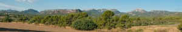
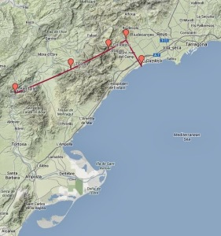

*Dedicat a en [Jordi](http://www.flickr.com/photos/86193874@N06/), gran coneixedor de les nostres terres.*

Las sierras por donde transcurre gran parte de este recorrido, la de Tivissa, Llabería y la Mola de Colldejou – [Lluís Ribes i Portillo (cc)](http://creativecommons.org/licenses/by-nc-nd/3.0/)

Simplificación de las 4 etapas – [©2013 Google](https://mapsengine.google.com/map/edit?mid=zFhLUhH-nQPQ.kVmIVoW_cMYM)

Esta entrada del bloc es el resumen de los cuatro días de travesía que realicé por las tierras tarraconenses del Baix Ebre, un poco del Priorat y Baix Camp, lugares un tanto desconocidos y no muy frecuentados por el senderista pero que no dejan de tener un gran atractivo. Al final del artículo, tenéis un link con el detalle de cada una de las etapas etapa.

La travesía que sigue en parte el sendero de gran recorrido GR7 (Tarifa-Finlandia) comienza en el río Ebro, más concretamente en el la antigua estación de Benifallet ahora convertido en un acogedor albergue dentro del bosque. En la primera jornada desde Benifallet atravesaremos la Serra de Cardó, cruzaremos una zona amplia de cultivo y tras subir por las montañas de Tivissa llegaremos al mismo pueblo de Tivissa. Aquí agarramos fuerzas para empezar la segunda jornada en forma. En ella predominará los bosques de pinos y un par de ascensiones a dos collados para salvar cadenas montañosas que nos harán pasar por el pintoresco y remoto pueblo de Llaberia hasta llegar a Colldejou. De Colldejou una tercera etapa más tranquila por los pueblos de Argentera y Duesaigües visitando el castillo de Escornabou con unas espectaculares vistas del campo de Tarragona para llegar a Riudecanyes donde pasaremos la última noche bajando a buscar el tren a Cambrils por la riera al día siguiente.

En mi caso la realicé a mediados de septiembre. En los cuatros días (dos de ellos laborables) no me crucé con ningún excursionista, alguna bici en las dos últimas etapas y mis pensamientos que solo desaparecían de vez en cuando cuando el viento soplaba moderadamente.

**Dificultad**

Para cualquier persona acostumbrada a realizar excursiones de montaña no tiene una dificultad especial. Eso sí, hay que evitar totalmente el verano y en general los días de calor ya que las largas distancias a caminar unido a una naturaleza de bosques no especialmente húmedos y tramos largos expuestos al sol puede complicarlo mucho con el calor. Algún día caminaremos bastante por lugares un poco remotos de cualquier pueblo, por tanto llevar abundante agua y una buena protección solar.

Por lo demás, la ruta está excelentemente señalada y solo hay dos pasos de montaña que requieren un cierto esfuerzo (300 o 400 metros de desnivel en un tramo corto) sobretodo teniendo en cuenta que llevamos kilómetros acumulados, pero nada especial.

**Alojamiento**

Los alojamientos los realicé entre albergues, fondas y un hotel. A excepción de Colldejou que solo hay un hotel para alojarse en un radio de 5 km. en el resto de poblaciones donde hice noche tienes siempre varias opciones.

Os indico a continuación los alojamientos donde estuve:

-   [Albergue la Estación](http://www.estaciodebenifallet.com/es/), Benifallet tel: 652 94 07 03
-   [Camping / Albergue](http://www.albergcampingtivissa.cat/), Tivissa tel: 977 41 73 16
-   [Hotel Aire de Colldajou](http://www.airedecolldejou.com/), Colldejou tel: 977 05 49 21
-   [Fonda Rovira](https://ca-es.facebook.com/pages/Hostal-Restaurant-Rovira/320256031408553), Riudecanyes tel: 977 83 44 71

**Equipo**

Ningún equipo especial más que el necesario para una travesía de cuatro días por campo y bosques de pinos teniendo alojamiento cada noche. Puedes llevar GPS pero mi recomendación es ir con mapas de la zona para poder tener una idea general de los recorridos, las distancias a recorrer y sobretodo para reconocer el territorio gracias a la gran información que tiene un mapa sobre la zona. En mi caso usé dos mapas:

-   [Mapa topogràfic de Catalunya Mora d’Ebre del ICC escala1:25.000](http://www.icc.cat/cat/Home-ICC/Publicacions/Cartografia-impresa/Mapes-topografics)
-   [Mapa Serra de Llaberia de la Editorial Piolet, escala1:20.000](http://www.editorialpiolet.com/servlet/LibrosPorZonas/ACTIVATEMENU--novedades.html)

**Etapas**

A continuación un link a la explicación de cada una de las cuatro etapas

-   [Primera Etapa: Benifallet – Tivissa (escrito septiembre2013)](http://www.lluisribes.net/?p=65)
-   [Segunda Etapa: Tivissa – Colldejou (escrito octubre 2013)](http://www.lluisribes.net/?p=62)
-   [Tercera Etapa: Colldejou – Riudecanyes (escrito noviembre 2013)](http://www.lluisribes.net/?p=59)
-   [Cuarta Etapa: Riudecanyes – Cambrils (escrito diciembre 2013)](http://www.lluisribes.net/?p=54)