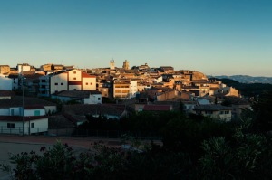
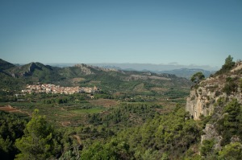
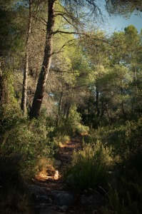
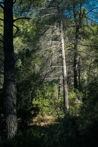
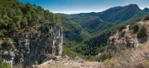
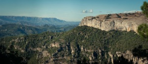

Segunda etapa, Travesía Benifallet Cambrils

Tivissa-Colldejou,  [Recorrido Wikiloc](http://ca.wikiloc.com/wikiloc/view.do?id=5772093)

**Distancia**: 25 km.

**Duración**: salida a las 9:30 y llegada a las 19:00 a un ritmo muy tranquilo

[Enlace a la primera etapa](http://www.lluisribes.net/?p=65) – [enlace a la tercera etapa](http://www.lluisribes.net/?p=59)

Tivissa al amanecer –  [Lluís Ribes i Portillo (cc)](http://creativecommons.org/licenses/by-nc-nd/3.0/)

Esta segunda etapa sigue siendo una de las largas de la travesía y pese no ser tan larga como la primera sí que es un poco más dura y más solitaria. Estaremos lejos de carreteras y poblaciones en gran parte del recorrido y no la recomiendo hacer en un día caloroso porque es un terreno que pese haber bosque es poco húmedo y el camino es largo con  algunos tramos que ascienden bastante. Nuestro objetivo será llegar al pueblo de Colldejou atravesando la Serra de Llaberia. Esta etapa también sigue en su totalidad un tramo del sendero de gran recorrido GR-7.

La mañana la comienzo desayunando en el restaurante Missamaroi. No abren muy temprano pero es un buen lugar para el desayuno. A las 09:30 nos ponemos a caminar y dejamos Tivissa por el noreste llegando a la carretera principal que va hacia Vandellós que es la C-44 y a la derecha en 50 metros veremos una indicación del GR-7 que nos hace torcer por un camino a la izquierda que comienza a bajar  entre unos cultivos para volver a subir donde dejaremos el sendero que compartía con el PR-C 182 a mano izquierda y nos adentramos en el bosque. Siempre  por el GR-7.

Tivissa desde les Moles –  [Lluís Ribes i Portillo (cc)](http://creativecommons.org/licenses/by-nc-nd/3.0/)

A primera hora de la mañana, la luz entra por el bosque y la tranquilidad es máxima. Cogiendo un poco de altura cuando el camino sale un momento del bosque podemos ver una bonita estampa de Tivissa, coronada por sus montañas. La subida es suave y agradable a pesar que pasa por debajo de la linea de alta tensión de 380 kv con su particular zumbido. Pasada la linea el camino discurre entre terrenos de masías, frondosa vegetación baja y algún que otro árbol lleno de abejas que recolectan su preciado néctar.  Un poco más allá de la caseta del Capcir caminaremos por un trozo de bosque hermoso. Habrá un momento que saldremos de él y unas rocas se presentarán debajo de nuestros pies donde con cuidado podremos asomarnos y disfrutar de la belleza del Barrancó de Cassayes, un rincón muy agradable de la sierra. Más adelante, el camino nos lleva al Barranc de Capcir donde nuestro sendero se une con un camino más ancho que se dirige al norte. Al cabo de diez minutos llegamos a una pequeña plana donde el camino se abre y llegamos a unas indicaciones al lado de un depósito de agua. Como en la primera etapa, el Gr-7 en el camino nos indica un camino diferente al que tenemos en el mapa. El poste señala continuar en dirección el pueblo La Serra d’Almos mientras que nuestro mapa nos indica  torcer a la derecha por la pradera entre unos tablones de madera que poco a poco la vegetación los va haciendo desaparecer. Mi opción fue seguir el mapa y torcí a la derecha. Tras pasar por una pequeña riera seca en diez minutos nos encontramos con el nuevo recorrido del GR-7 que hemos evitado y proseguimos.

Dentro del bosque –  [Lluís Ribes i Portillo (cc)](http://creativecommons.org/licenses/by-nc-nd/3.0/)

El día era un día caluroso de septiembre y a esta altura el calor era intenso y la cantidad de agua que tenía justa. Hice un mal cálculo a la mañana para aligerar el peso… y esperaba repostar agua en una fuente permanente llamada la Fuente de la Pena y que está fuera del camino. Esta se sitúa en un sendero que sube a la izquierda tras un indicación. Perdí 40 minutos en encontrarla, subí montaña arriba hasta una señal que dibujaba un NO en un árbol, lo que me hizo volver al camino principal. Pero antes de llegar observé a mano derecha unas cañas a las que me acerqué con ilusión de encontrar la fuente y así fue. Pero si algo le caracteriza a esta fuente es su nombre, La Pena. La pena que tuve al ver que era una charca donde apenas salían unos tubos que bajaban para suministrar agua al depósito de los bomberos en el camino.  La sensación que tuve fue un poco de idiota y si bien fue divertido encontrar la fuente no sirvió de nada.

Dentro del bosque –  [Lluís Ribes i Portillo (cc)](http://creativecommons.org/licenses/by-nc-nd/3.0/)

Continuo por el sendero del GR-7 y se llega al Mas de Castellnou donde encontramos un cartel informativo que nos explica su historia. A partir de este punto tenemos una buena subida de un desnivel de 200 metros que nos llevará hasta la Portella del Montalt que es el paso de montaña y en donde el camino pasado el paso hace un giro a la izquierda entrando en la umbría de la montaña y penetrando en un bosque frondoso. En un día de calor, este punto es un gran descanso porque podremos caminar durante unos minutos bajo una fresca sombra y recuperarnos de la subida con vistas al Priorat. También aprovecho para comer el bocadillo de tortilla francesa que me han preparado a la mañana.

Estamos a mitad de la etapa, pasado las tres de la tarde y de repente el camino baja dramáticamente hasta un camino asfaltado. Hemos vuelto a la civilización, asfalto, carteles de municipios, de restaurantes… hay que seguir y hay que girar a mano derecha por el camino asfaltado durante treinta minutos pasando por al lado de las [viñas Domenech](http://www.vinyesdomenech.com/) y de un hotel situado en un lugar muy tranquilo. El camino asfaltado es cómodo, pero volvemos a estar bajo el sol intenso hasta que llegamos al fondo del valle en una zona donde las aguas permanentes de la Serra de Llaberia se reunen en un pequeño río que crea unas balsas entre la vegetación. Es un rincón fresco, donde se recoge agua para su uso municipal aunque no encontré ningún grifo para poder llenar la cantimplora. Pero no quita que sea un buen lugar para hacer una parada antes de dejar el asfalto y volver al bosque para subir a la Serra de Llabería. 

El Barranc del Tortó –  [Lluís Ribes i Portillo (cc)](http://creativecommons.org/licenses/by-nc-nd/3.0/)

La subida a Llabería se hace por el barranco del Tortó. Es una subida de unos 350 metros de desnivel y comienza un poco antes de las balsas en un camino que sube por unos peldaños adentrándose en el bosque. Al cabo de diez minutos por espesa vegetación comienza a subir considerablemente pasando justo por debajo de una gran pared donde se practica la escalada. El camino sube y sube serpenteando por la colina y los kilómetros que tenemos en nuestras piernas pesan considerablemente. Una vez vamos llegando a la cima podemos ver un espléndido paisaje: a nuestros pies el barranco por el que hemos subido así como la Serra del Montalt o la del Coscoll al fondo con sus dos aerogeneradores del parque eólico, no muy comprensible por otra parte, del Motarro. Subimos un poco más y pronto el camino nos lleva al interior de la sierra y el pequeño pueblo de Llaberia se asoma.

El pueblo de Llaberia se sitúa en la meseta de su sierra, está en una situación privilegiada en un paraje de un gran valor natural y destaca su iglesia románica. Es un pueblo minúsculo con gran encanto y que lo están arreglando y dejándolo bien bonito. Por mi parte llegué un poco sediento y me fui directamente a la fuente del pueblo sin preocuparme de hacer alguna foto a las remodeladas fachadas de las casas. Me costó un poco encontrarla a pesar de preguntar por ella. Está a las afueras, se accede bajando por una calle que pasa por debajo de un arco y nos lleva entre unos pequeños huertos a la fuente. Es una fuente grande, con un par de balsas y alguna que otra libélula grande y colorida volando por sus alrededores. En una de las paredes un grifo donde poder beber y llenar cantimploras con una agua buenísima. Leí que las fuentes de la Serra de Llabería son de un agua excelente y sin duda lo son, después de la caminata fue todo un regalo beber de ellas.

Las montañas de Prades y la Mola de Colldejou –  [Lluís Ribes i Portillo (cc)](http://creativecommons.org/licenses/by-nc-nd/3.0/)

Pero la tarde avanzaba y pese estar cerca del final de la segunda etapa, el pueblo de Colldejau, no se podía perder tiempo. Me enfilo por el camino que sale hacia al norte del pueblo dirección al paso del Portell de Llaberia. A medida que se llega a la cresta caminaremos por unas formaciones de roca redondas y hasta por un tramo cubierto de arena de playa. Difícil de imaginar como en una meseta a 700 metros sobre el nivel de mar se haya podido acumular toda esa arena, era un tanto mágico. Al llegar al Portell de Llaberia tenemos otra espléndida panorámica en este caso de las montañas de Prades al fondo y en primer plano la Mola de Colldejou. Proseguimos bajando muy pronunciadamente y haciendo eses. Mientras bajo pienso en lo duro que sería en ese momento rehacer el camino hacia arriba,… Ya queda menos, acabado el descenso pronto se empalma con un camino principal que nos llevará al Coll de Guix, una zona de recreo de donde parte varios caminos uno de ellos a lo alto de la Mola de Colldejou. Pero eso será otra excursión. Continuamos hacia nuestro destino cuando de repente se abre el camino y delante nuestro podemos ver el mar y los campos de Tarragona. La sensación es extraña, tras dos días caminando por bosques y en donde no me he cruzado con ningún excursionista esa postal me emociona y satisfecho bajo los siguientes 15 minutos hasta Colldejou con la sensación de haber visitado unos lugares singulares.

El pueblo de Colldejou es la puerta de entrada de las sierras colindantes, La Serra de Llabería, La Mola de Colldejou, La Serra d’Argentera así como el último pueblo antes de entrar en la comarca de El Priorat. Es un pueblo pequeño, con muy pocos servicios y el único alojamiento que hay es el Hotel [Aire de Colledejou](http://www.airedecolldejou.com/), un hotel con unos caseros muy atentos y donde podremos descansar muy bien en unas cómodas habitaciones por 40€ (ojo a la bañera, una gran amiga tras un día duro). Claro está que puedes cenar en el mismo hotel pero os contaré un secreto, en el pueblo hay un casa social con un bar cafetería donde puedes cenar bien y completo por unos 11€. Y como postre podéis cuando volváis al hotel agarrar del figuero que hay de camino alguna pieza dulce.

Ha sido una etapa muy bonita, un poco dura dado que el calor ha apretado y personalmente no calculé el agua que tenía que llevar 🙁 pero la satisfacción es plena.

En las dos siguientes etapas de la travesía, dejamos los bosques y los lugares remotos así como las largas caminatas pero no por ello dejaremos de disfrutar. Aun quedan muchas cosas a ver. Hasta la próxima etapa.