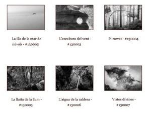
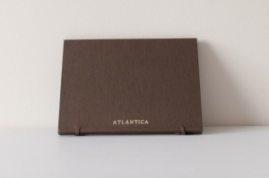

El 8, 9 y 10 de noviembre se celebra la [III exposición solidaria de arte de la Fundación Pablo Horstmann](http://www.fundacionpablo.org/index.php/97-eventos/329-iii-exposicion-benefica-de-arte-fundacion-pablo-horstmann). Para esta ocasión han querido contar entre otros muchos trabajos con obra de mi proyecto fotográfico **ATLÁNTICA,** podéis visitar la web del proyecto aquí: [http://www.lluisribes.net/atlantica](http://www.lluisribes.net/atlantica)

Para ello se ha creado un estuche para la ocasión que se pondrá a la venta con seis de las fotografías de esta *isla tan particular* llamada **ATLÁNTICA***.* Son seis copias de gran calidad impresas por mi mismo y con su correspondiente certificado de autenticidad. Cada una de ellas es la primera copia que se realiza y así se deja constancia en el certificado. Tenéis más información de las fotografías que vienen en el estuche [aquí](http://www.lluisribes.net/atlantica/estuche-fundon-pablo-horstm/las-fotografias/).

Este trabajo estará expuesto para su venta los días de la exposición 8, 9 y 10 de noviembre en el [Círculo de Bellas Artes de Madrid](http://www.circulobellasartes.com/), Calle Alcalá, 42 en la Sala Juana Mordó. Todo el beneficio obtenido de la venta de las obras de la exposición se destinarán en su integridad al Hospital Pediátrico Pablo Horstmann de Anidan en Kenia.  
**ATLÁNTICA** acompañará otras obras en la exposición de fotógrafos muy reconocidos, podéis ver el listado completo [aquí](http://fundacionpablo.org/ARTE/index.php/fotografia-1) . También se expondrán obras pictóricas y escultóricas. No os la podéis perder.  
A continuación unas fotos del estuche:

El estuche cerrado –  [Lluís Ribes i Portillo (cc)](http://creativecommons.org/licenses/by-nc-nd/3.0/)

El estuche abierto y sus seis fotografías –  [Lluís Ribes i Portillo (cc)](http://creativecommons.org/licenses/by-nc-nd/3.0/)

Y para finalizar una frase que me encanta que la oí de boca de [Mariano Zuzunaga](http://www.marianozuzunaga.com/) hace ya unos años:

“La fotografía habla de eso, de la fotografía, no de la realidad”