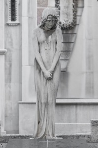

Aquí os dejo las dos fotos que presenté para el concurso de los cementerios de Barcelona [*Cementiri És Ciutat*](http://www.cementiriesciutat.cat/) . Como algunos de vosotros sabréis no son muy dado a participar en concursos y creo que tras la deliberación del jurado van a pasar unos cuantos años más hasta presentarme a otro :-). Pero ha sido un trabajo muy agradable de hacer.

Las dos fotografías están tomadas en el cementerio de Montjuïc de Barcelona. Es una estatua que me encantó y el detalle de sus manos me enamoró.

Tomadas a primera hora de la mañana, cuando los cipreses y los nichos todavía no proyectaban un mosaico de luces y sombras sobre ella difíciles de domar, el objetivo de 85 mm. me permitió recortar la figura del fondo con delicadeza.

Espero que os gusten.

(sin título) –  [Lluís Ribes i Portillo (cc)](http://creativecommons.org/licenses/by-nc-nd/3.0/)

“Mans” –  [Lluís Ribes i Portillo (cc)](http://creativecommons.org/licenses/by-nc-nd/3.0/)