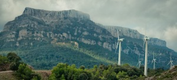
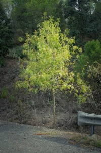
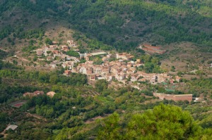
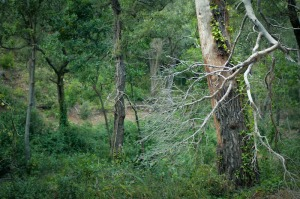
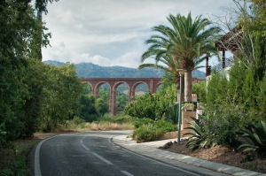
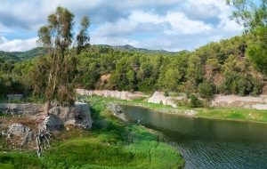
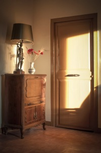

Tercera etapa, travesía Benifallet CambrilsColldejou – Riudecanyes, [Recorrido Wikiloc](http://ca.wikiloc.com/wikiloc/view.do?id=5573118)  
**Distancia**: aproximádamente 17 km  
**Duración**: salida de mañana a las 09:30 y llegada con la calma a las 18:00 horas  
[Enlace a la segunda etapa](http://www.lluisribes.net/?p=62) – [enlace a la última etapa](http://www.lluisribes.net/?p=54)  
  
Entramos en la tercera etapa. Esta se presenta mucha más tranquila y menos exigente que la segunda, va a ser una etapa por donde pasaremos por dos pueblecitos y un castillo llegando a un pequeño embalse que será el último hito antes de llegar a nuestro reposo de la etapa situado en Riudecanyes.

En el hotel de Colldejou me preparan el desayuno. Ese día era el único inquilino pero pese a eso me prepararon un completo buffet libre. Aproveché para entablar conversación con el dueño, un chico muy majo que me explicó diferentes rutas a realizar desde allí. Por ejemplo la subida de la Mola de Colldejou, que prometía unas vistas espectaculares, o otra excursión que volvía a subir a Llaberia para llegar a un lugar donde en la segunda guerra mundial se estrelló una avioneta, aunque a día de hoy ya no queda restos o otra excursión que era una de las posibles que barajaba y consistía en bajar a Pratdip por Les Crestes de la Seda. ¡Qué buenas excursiones! Aunque lamentablemente ya tenía el rumbo fijado hacia Riudecanyes pasando por los pueblos de L’Argentera y Duesaigües y no podía permitirme el cambiar de ruta.

Parque eólico de Trucafort – [Lluís Ribes i Portillo (cc)](http://creativecommons.org/licenses/by-nc-nd/3.0/)

Finalizo el desayuno, me despido del Hotel Aire de Colldejou y detrás de este subiendo por unas escaleras en el pueblo agarro otra vez el sendero GR-7. Esta etapa ya no será exclusivamente de GR-7, de hecho en L’Argentera nos desviaremos pero ya lo veremos más adelante. De momento el sendero me lleva a bordear el macizo donde reposa la Mola y visualizo rápidamente los molinos de viento del parque eólico de Trucafort. Estos serán nuestra siguiente visita. Siguiendo el sendero, se llega a una intersección con la carretera T-322 justo en el puerto montaña y en donde aparece un camino de hormigón que sube. Este camino es la entrada al parque eólico de acceso público. Entramos. La subida es corta, vemos unas marcas de 21% de pendiente muy prácticas para los ciclistas, no tanto para el caminante pero quizá es un buen momento para darse la vuelta y contemplar la Mola de Colldejou, y como su nombre indica, ver una auténtica muela, seguramente de aquellas del juicio que el dentista te pide quitártela para su colección de trofeos dado que no tiene su contramuela… allí está y la subida a ella promete unas buenas vistas como el casero del hotel comentó. Pero no nos desanimamos, en el mismo parque eólico una vez arriba y tras llegar arriba del macizo ya entre unos cuantos molinos, nos dirigiremos hacia el este, es decir hacia la cornisa que da al mar pero con precaución cuando estemos cerca ya que estaremos cerca de una caída de decenas de metros y el viento puede hacernos jugar una mala pasada. El mejor lugar quizá cerca de una señera que ondea sin cansancio al paso de los vientos. Allá podemos sentarnos y contemplar bajo nuestros pies todo el campo de Tarragona, Salou, la misma ciudad de Tarragona, el pueblo de l’Argentera y Duesaigües y la vía del tren que transcurre sobre grandes viaductos de piedra color rojiza así como el castillo de Escornalbou y mucho más. Es una gran vista que no pude disfrutar del todo por un cielo fuertemente nublado y una visibilidad no muy alta. Pero el viento, aquel día convertido en una suave brisa se me llevaba la sudor de los anteriores días y me traía paz y sosiego.

 Un árbol en el camino – [Lluís Ribes i Portillo (cc)](http://creativecommons.org/licenses/by-nc-nd/3.0/)

Tras descansar unos veinte minutos proseguimos por el parque eólico por el camino principal. En este nos encontraremos un cartel informativo del parque y del funcionamiento de este y un poco más adelante llegaremos al Portell del Peiró, encrucijada de caminos. Aquí, continuando el sendero GR-7 nos desviamos a la derecha y comenzamos a bajar moderadamente. El paisaje cambia, caminamos montaña abajo entre arbustos pasando por al lado de la Cova del Cabrer y caminando por encima de unas formación rocosa arrodondeadas y rojizas muy curiosas. Es un lugar donde abundan las minas, de allí el nombre del pueblo al que nos estamos acercando l’Argentera (*argent* significa plata en catalán y desde la época romana se han explotado yacimientos de este material) hasta el punto que  pasaremos por al lado de una buena escombrera de una pedrera. Allá, si somos un tanto curiosos podemos buscar minerales o algunas piedras bonitas, que difícilmente serán preciosas ☺. Unas curvas más en el camino y entramos en l’Argentera no antes sin ver un panel informativo del recorrido del GR-7 (que abandonamos aquí) por toda Cataluña, desde Fredes a Andorra.

L’Argentera tiene una calles centrales muy bien conservadas y pintorescas y una vuelta por él es totalmente recomendable.. Llegué a un restaurante con grandes salas y una terraza en el piso inferior donde me tomé un refresco de cola antes de subir al castillo. El restaurante es llamado Menjars L’argentera.

El pueblo de l’Argentera – [Lluís Ribes i Portillo (cc)](http://creativecommons.org/licenses/by-nc-nd/3.0/)

De allí volvemos a subir un poco por el pueblo, nos dirigimos a la iglesia y preguntamos por el camino que sube al Castell d’Escornalbou. Este comienza detrás de la iglesia bajando hacia un pequeño barranco donde hay un desvío hacia el castillo y rápidamente veremos como el camino es una subida constante de peldaños que nos subirán a 250 metros para arriba. El camino lo hago en solitario y no solo es el nombre del camino, el Camí dels Frares, el que me hace sentirme un monje sino la naturaleza que envuelve al camino, y sus peldaños, una escalera mística al monasterio. De tanto en tanto, una vuelta atrás para ver como hemos cogido altura y poder ver el pueblo de l’Argentera en su totalidad. Subes y subes, es una subida suave pero constante hasta llegar al aparcamiento del castillo.

El Castell d’Esconalbou se levanta sobre el antiguo monasterio de Sant Miquel d’Escornalbou y fue una casa de encuentro de las principales figuras del renacimiento invitados por Eduard Toda, propietario del castillo. Actualmente se puede visitar sus estancias y si bien yo no lo hice no parece mala idea hacerlo. Pero lo que no os podéis perder, viajeros de mochila, es subir a la ermita, 60 metros más arriba. La ermita se sitúa en lo más alto de la montaña justo sobre un pequeño balcón donde las vistas son espectaculares: otra vez del campo de Tarragona, el meditarraneo, el Priorat…, es una vista prácticamente de 360 grados donde podemos sentarnos en un día que no concurre mucha gente, cruzar las piernas apoyar los brazos en ellos y desconectar dado que las sensaciones son especiales. Y por supuesto si tienes una cámara, no te olvides de hacer fotos.

Bosque encantado en Duesaigües – [Lluís Ribes i Portillo (cc)](http://creativecommons.org/licenses/by-nc-nd/3.0/)

Esta ermita, la Ermita de Santa Bárbara, tiene quizá la mejor vista de la travesía sobre la que estoy escribiendo y siempre se puede volver a visitar con facilidad dado que el acceso con coche es fácil por la carretera que sube. Por ella continua  nuestra excursión, desde el parking del castillo, bajamos hasta el kilómetro 4 pasado una capilla donde a escasamente 50 metros vemos un camino de hormigón a mano izquierda que indica Duesaigües, nuestra siguiente parada. El camino es el PR-C 28, si no recuerdo mal es el camino real, en cualquier caso no tiene pérdida. Es un camino ancho por donde transcurren algunos utilitarios, bicicletas y donde me crucé por primera vez con varias personas que paseaban por ella. Pero lo mejor estaba pasado las primeras curvas que te adentran al fondo del barranco y que durante los siguientes 500 metros nos regalará una vegetación frondosa e inesperada. Esta, a la tarde es en algunos detalles sobrecogedora y me recuerda a la Atlántica: árboles  singulares de copas altos, llenos de vegetación en sus troncos, lianas que caen del cielo como si de una tormenta de hojas se tratara y una sombra en la que en un día con nubes ves respirar el bosque con sus continuos cambios de luz. Este rincón, seguramente potenciado por la luz de la tarde con la que coincidí fue un descubrimiento increíble. Tenía la tentación de salir del camino y adentrarme más al fondo del barranco pero mi destino final aun estaba lejos y la noche podía caer sin darme cuenta si me perdía entre tanta naturaleza.

 Duesaigües – [Lluís Ribes i Portillo (cc)](http://creativecommons.org/licenses/by-nc-nd/3.0/)

Proseguí, hasta llegar a Duesaigües. Al llegar a la carretera, a mano izquierda una postal insólita: el viaducto de piedra del tren al fondo, una curva exótica de la carretera y una finca que me recuerda a un estilo colonial con altos muros blancos y un jardín custodiado por palmeras, cactus y exuberante vegetación. ¿Estábamos en Tarragona…? Pues sí

Ahora hay que girar a la derecha y cruzar el pueblo por debajo hasta salir de él y antes de llegar al cruce de carretera con la T-313, a mano derecha el camino se dirige paralelo a la carretera hacia Riudecanyes adentrándose en unos pequeños bosques por un camino de tierra y tras veinte minutos aparecerá el pantano de Riudacanyes. A nuestra izquierda justo cuando comienza una pista asfaltada pude ver como dos pescadores practicaban su deporte favorito delante del antiguo molino de la Bonica y continuando por la pista el paisaje y el ambiente cambió. Definitivamente dejaba atrás la montaña tarraconense, los aire un poco ermitaños que comenzaban a dibujarse en mi barba sin afeitar y me iba cruzando con familias, parejas, personas con su mascota y otros que paseaban por la orilla del embalse y si no paseaban restaban en la orilla con un picnic, pescando, jugando al balón … Era un ambiente familiar casi urbano, tranquilo y acogedor y una bienvenida al pueblo de Riudecanyes que me vino muy de gusto.

 Embalse de Riudecanyes – [Lluís Ribes i Portillo (cc)](http://creativecommons.org/licenses/by-nc-nd/3.0/)

sin título – [Lluís Ribes i Portillo (cc)](http://creativecommons.org/licenses/by-nc-nd/3.0/)

Al finalizar el paseo y antes de entrar en el pueblo puedes caminar por presa. Yo hice un asomo pero rápidamente me dirigí a la parte baja del pueblo, donde la carretera atraviesa la riera hasta llegar a una rotonda. Allá se encuentra mi última posada del viaje, [el restaurante Rovira](https://ca-es.facebook.com/pages/Hostal-Restaurant-Rovira/320256031408553). Es fácil de localizar y es uno de los lugares de reunión de la gente del pueblo, tiene un patio grande donde disfrutar de un vermut y dentro un salón con unas pantallas geniales para ver los partidos de fútbol 😉 donde eres amablemente atendido. De allí te acompañarán a las habitaciones, que comparten una sala de estar y un baño, por una escalera empinadísima… llegando a la primera planta donde de repente das un salto hacia atrás en el tiempo… veinte, treinta años? Los muebles, las cortinas, la butaca y cómodas, el color de las paredes, los adornos nos llevan a mediados del siglo pasado pero todo está ordenado y limpio.  Aunque un pero… la cama de muelles con un somier de muelles casi te permitía tocar el culo con el suelo cuando te estirabas en ella. Pero lo que pensé que no me dejaría descansar no pasó y tras cenar en el comedor (la carta tiene unas carnes a la brasa excelentes) dormí tranquilamente  esa noche. Hasta el comienzo de la última etapa.