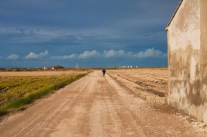

“Torna aviat” – [Lluís Ribes i Portillo (cc)](http://creativecommons.org/licenses/by-nc-nd/3.0/)

**L’ESPAI DE MI**

Vetlla l’espai de mi que et configura

i així sabràs que mai no s’interposa

entre tu i jo cap llei de melangia.

No et recordo enyorós: t’estimo en una

dimensió de mi que no sabia

potser perquè el teu cos me l’ocultava.

Ara m’atardo amb tu sense tenir-te

pels blaus i verds lentíssims de la tarda

i pels ocres tendríssims del poema.

[Miquel Martí i Pol](http://ca.wikipedia.org/wiki/Miquel_Mart%C3%AD_i_Pol)