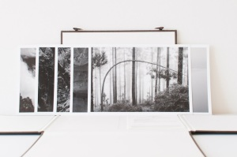

La [III exposición solidaria de arte de la Fundación Pablo Horstmann](http://fundacionpablo.org/ARTE/) finalizó consiguiendo a través de las obras donadas que se vendieron cubrir a 3800 niños con tratamiento e ingresos médicos en el Hospital Pablo Horstmann en Kenia durante un año.

Aún quedan obras por vender entre ellas el estuche con seis fotos de la [ATLÁNTICA](http://www.lluisribes.net/atlantica/) que doné:

El estuche cerrado –  [Lluís Ribes i Portillo (cc)](http://creativecommons.org/licenses/by-nc-nd/3.0/)

El estuche abierto y sus seis fotografías –  [Lluís Ribes i Portillo (cc)](http://creativecommons.org/licenses/by-nc-nd/3.0/)

Más información del estuche: [http://www.lluisribes.net/atlantica/estuche-fundon-pablo-horstm/](http://www.lluisribes.net/atlantica/estuche-fundon-pablo-horstm/)

Su **precio es de 300 €**, y con estos 300€ no solo **te llevas las primeras 6 fotografías de la ATLÁNTICA** que se publican con una calidad excepcional y un hermoso estuche para resguardarlas mientras no las tengas expuestas sino que **darás la oportunidad a que 30 niños más puedan tener la asistencia médica asegurada durante un año** en el Hospital Pablo Horstmann en Kenia. Porque todo el dinero de la venta de las obras de la exposición va íntegramente al hospital.

**Si estás interesado ponte en contacto con [*expo@fundacionpablo.org*](mailto:expo@fundacionpablo.org) o conmigo mismo en [*fotos@lluisribes.net*](mailto:fotos@lluisribes.net)**