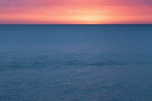

“Rosa i blau” – [Lluís Ribes i Portillo (cc)](http://creativecommons.org/licenses/by-nc-nd/3.0/)

Caminante, son tus huellas

 el camino y nada más;

 Caminante, no hay camino,

 se hace camino al andar.

Al andar se hace el camino, 

y al volver la vista atrás

se ve la senda que nunca

se ha de volver a pisar.

Caminante no hay camino 

sino estelas en la mar.

[Antonio Machado](http://es.wikipedia.org/wiki/Antonio_Machado)