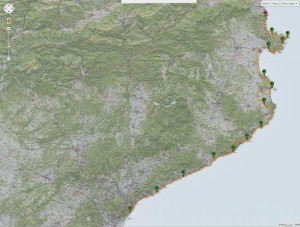

Detall del recorregut sobre mapa de la travessa Barcelona – Portbou a peu

Ja es poden consultar les 14 etapes de la **travessa Barcelona – Portbou a peu** realitzat entre les dates 23 de novembre i 6 de desembre de 2013.

Tota la informació s’ha pujat a la web [**Wikilocs**](http://ca.wikiloc.com/wikiloc/user.do?id=934671), a on podreu:

-   Veure el recorregut de l’etapa sobre diversos tipus de mapes
-   Descarregar el recorregut pel vostre dispositiu GPS o el Google Earth
-   Visualitzar el perfil de l’etapa
-   Una breu descripció amb apunts a tenir en compte de l’etapa
-   A on es va dormir
-   Enllaç a l’anterior i següent etapa per una navegació fàcil
-   6 fotografies realitzades a l’etapa
-   Comentaris

A continuació s’adjunta la llista d’enllaços a **les 14 etapes** amb la informació a Wikilocs:

-   [*Barcelona – Vilassar de Mar (1ª etapa Barcelona – Portbou)*](http://ca.wikiloc.com/wikiloc/view.do?id=5785997)
-   [*Vilassar de Mar – Canet de Mar (2ª etapa Barcelona – Portbou)*](http://ca.wikiloc.com/wikiloc/view.do?id=5798897)
-   [*Canet de Mar – Blanes (3ª etapa Barcelona – Portbou)*](http://ca.wikiloc.com/wikiloc/view.do?id=5802755)
-   [*Blanes – Tossa de Mar (4ª etapa Barcelona – Portbou)*](http://ca.wikiloc.com/wikiloc/view.do?id=5803825)
-   [*Tossa de Mar – Sant Feliu de Guixols (5ª etapa Barcelona – Portbou)*](http://ca.wikiloc.com/wikiloc/view.do?id=5808138)
-   [*Sant Feliu de Guíxols – Palamós (6ª etapa Barcelona – Portbou)*](http://ca.wikiloc.com/wikiloc/view.do?id=5817668)
-   [*Palamós – Pals ( 7ª etapa Barcelona – Portbou)*](http://ca.wikiloc.com/wikiloc/view.do?id=5823447)
-   [*Pals – L’Estartit ( 8ª etapa Barcelona – Portbou)*](http://ca.wikiloc.com/wikiloc/view.do?id=5868748)
-   [*L’Estartit – L’Escala ( 9ª etapa Barcelona – Portbou)*](http://ca.wikiloc.com/wikiloc/view.do?id=5874925)
-   [*L’Escala – Roses ( 10ª etapa Barcelona – Portbou)*](http://ca.wikiloc.com/wikiloc/view.do?id=5875572)
-   [*Roses – Cadaqués ( 11ª etapa Barcelona – Portbou)*](http://ca.wikiloc.com/wikiloc/view.do?id=5875912)
-   [*Cadaqués – Cap de Creus ( 12ª etapa Barcelona – Portbou)*](http://ca.wikiloc.com/wikiloc/view.do?id=5876664)
-   [*Cap de Creus – Port de la Selva ( 13ª etapa Barcelona – Portbou)*](http://ca.wikiloc.com/wikiloc/view.do?id=5878633)
-   [*Port de la Selva – Portbou ( 14ª i darrera etapa Barcelona – Portbou)*](http://ca.wikiloc.com/wikiloc/view.do?id=5884693)

De cara a les properes setmanes s’acabarà d’omplir tota la informació de la web d’aquest viatge:

[elpetitviatge.lluisribes.net](http://elpetitviatge.lluisribes.net/) 

a on es fa una aproximació particular d’aquesta aventura.

**Espero que la gaudiu** i que la informació us pugui ser útil.

(…. si voleu veure les fotos fetes amb el mòbil mentres caminava aquí teniu l’enllaç: [http://goo.gl/jy3Naf](http://goo.gl/jy3Naf) )