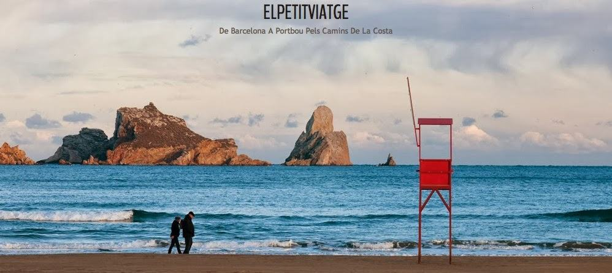
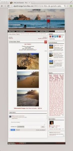
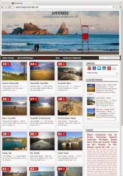

Hola,

avui formalitzo la inauguració de la web definitiva de **ElPetitViatge:**

**[elpetitviatge.lluisribes.net](http://elpetitviatge.lluisribes.net/)** 

Aquesta web és un exercici visual poètic i informatiu realitzat arrel de la travessa a peu de Barcelona a Portbou de finals de l’any 2013.

La web ha sofert canvis durant aquests darrers tres mesos, ha estat viva: va començar sent un lloc per conèixer les etapes que anava a realitzar, posteriorment un cop iniciat el viatge va ser un lloc de trobada a on poder veure l’evolució del viatge amb fotos i comentaris *in situ*. I un cop finalitzat el viatge s’ha convertit en un petit espai que combina textos poètics catalans i uns tríptics fets amb fotos meves del mòbil de cada dia en concret.

Tanmateix no deixa de ser un lloc d’informació del viatge amb els enllaços a la informació tècnica de la travessa (podeu trobar els enllaços al final de cada foto i a la secció “[Mapa](http://elpetitviatge.lluisribes.net/p/mapa.html)“).

A continuació us deixo la llista dels autors que acompanyen amb textos seus aquesta web:

-   [Josep Punsola i Vallespí](http://ca.wikipedia.org/wiki/Josep_Punsola_i_Vallesp%C3%AD) , amb un fragment del poema *Mataró* ([etapa 23-nov](http://elpetitviatge.lluisribes.net/2013/11/barcelona-vilassar-de-mar.html))
-   [Salvador Espriu i Castelló](http://ca.wikipedia.org/wiki/Salvador_Espriu_i_Castell%C3%B3), amb el *V poema de Cementeri de Sinera* ([etapa 24-nov](http://elpetitviatge.lluisribes.net/2013/11/vilassar-de-mar-canet-de-mar.html))
-   [Guerau de Liost](http://ca.wikipedia.org/wiki/Guerau_de_Liost): amb un fragment del poema *Quan el teu cor serà branca de Mirra* ([etapa 25-nov](http://elpetitviatge.lluisribes.net/2013/11/canet-de-mar-blanes.html))
-   [Josep Maria de Sagarra i de Castellarnau](http://ca.wikipedia.org/wiki/Josep_Maria_de_Sagarra_i_de_Castellarnau), amb un fragment del poema *Aiguamarina* ([26-nov](http://elpetitviatge.lluisribes.net/2013/11/blanes-tossa-de-mar.html))
-   [Joan Maragall i Gorina,](http://ca.wikipedia.org/wiki/Joan_Maragall_i_Gorina) amb dos fragments del poema *Vistes al Mar* ([etapa 27-nov](http://elpetitviatge.lluisribes.net/2013/11/tossa-de-mar-st-feliu-de-guixols.html) i [etapa 29-nov](http://elpetitviatge.lluisribes.net/2013/11/palamos-begur.html))
-   [Joan Teixidor i Comes](http://ca.wikipedia.org/wiki/Joan_Teixidor_i_Comes), amb el poema *L’Oblit* ([etapa 28-nov](http://elpetitviatge.lluisribes.net/2013/11/st-feliu-de-guixols-palamos.html))
-   [Maria-Mercè Marçal](http://ca.wikipedia.org/wiki/Maria_Merc%C3%A8_Mar%C3%A7al_i_Serra), amb un fragment d’un poema ([etapa 30-nov](http://elpetitviatge.lluisribes.net/2013/11/begur-estartit.html))
-   [Jaume Agelet i Garriga](http://ca.wikipedia.org/wiki/Jaume_Agelet_i_Garriga), amb el poema *Barques* ([etapa 01-des](http://elpetitviatge.lluisribes.net/2013/12/estartit-l.html))
-   [Josep Maria Boix i Selva,](http://ca.wikipedia.org/wiki/Josep_Maria_Boix_i_Selva) amb el poema *Endins* ([etapa 02-des)](http://elpetitviatge.lluisribes.net/2013/12/l-roses.html)
-   [Valentí Gómez i Oliver](http://www.valentinus.cat/), amb un fragment del poema *El plaer de l’instant* ([etapa 03-des](http://elpetitviatge.lluisribes.net/2013/11/roses-cadaques.html))
-   [Jacint Verdagueri Santaló](http://ca.wikipedia.org/wiki/Jacint_Verdaguer_i_Santal%C3%B3), amb un fragment del poema *La palmera* ([etapa 04-des](http://elpetitviatge.lluisribes.net/2013/11/cadaques-cap-de-creus.html))
-   [Marià Manent i Cisa](http://ca.wikipedia.org/wiki/Mari%C3%A0_Manent_i_Cisa), amb un fragment d’un poema ([etapa 05-des)](http://elpetitviatge.lluisribes.net/2013/11/blog-post.html)
-   [Marià Villangómez Llobet](http://ca.wikipedia.org/wiki/Mari%C3%A0_Villang%C3%B3mez_Llobet), amb un fragment del poema *Penso en el mar* ([etapa 06-des](http://elpetitviatge.lluisribes.net/2013/11/el-port-de-la-selva-portbou.html))

Al voltant d’aquest viatge pots trobar més informació al Wikilocs [ElPetitViatge de Barcelona a Portbou pels camins de Costa](http://es.wikiloc.com/wikiloc/view.do?id=5960427) així com al Twitter fent servir el hastag [#elpetitiviatge](https://twitter.com/search?q=%23elpetitviatge&src=typd&f=realtime) podràs veure tots el tweets entre ells aquells que anava penjant mentres estava a la travessa.

Com diu l’amic [Jordi](https://twitter.com/vilasjordi), aquesta web és “*una forma d’endreçar experiències, compartir-les i fer que els demés en puguem gaudir”.* Desitjo que així sigui.

