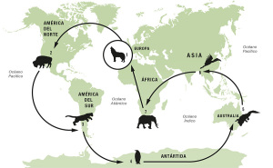
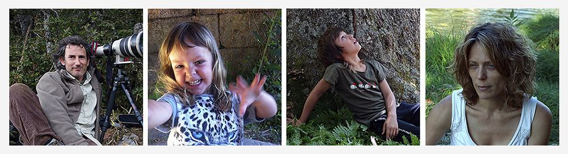

[Andoni Canela](http://andonicanela.blogspot.com.es/) continua con su familia su viaje alrededor del mundo en la búsqueda de especies salvajes y fascinantes en cada continente.

Andoni es un gran fotógrafo de naturaleza y animales salvajes y este proyecto, que le abarcará a él y a su familia Meritxell y a los pequeños Unai y Amaia más de un año recorriendo todos los continentes. Sencillamente fascinante porque en parte será para los chavales un curso escolar absolutamente fascinante, para la familia una experiencia y reto admirable y gracias a que lo comparten por Internet en su blog, fotoblog y otros medios, un gran viaje al que todos nos podemos apuntar.

A todo ello plantean la web como un aula virtual en donde los visitantes pueden generar clases y lecciones de los diversos entornos naturales a los que la familia se enfrenta.

No dejéis de visitar [LEARNING IN THE WILD](http://espiritusalvaje.com/)  relacionado con la vertiente más profesional de este proyecto: [LOOKING FOR THE WILD](http://www.lookingforthewild.com/)