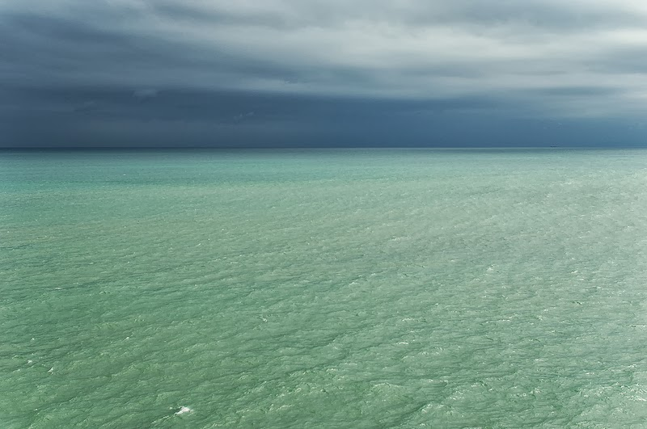
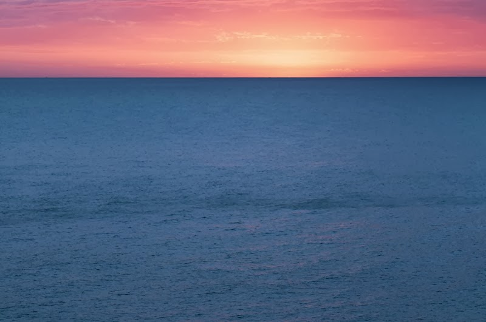
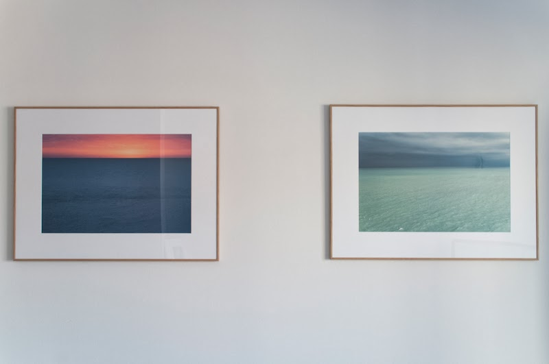

Este fin de semana he materializado dos fotografías. Actualmente acompañan el espacio de un pequeño salón.

“Blau i verd” – [Lluís Ribes i Portillo (cc)](http://creativecommons.org/licenses/by-nc-nd/3.0/)

“Rosa i blau” – [Lluís Ribes i Portillo (cc)](http://creativecommons.org/licenses/by-nc-nd/3.0/)

La primera foto la tomé en Abril de 2013 a la vuelta de una visita del pueblo del Garraf. Era mediodía, un día tapado y no fue hasta que volví por la carretera de la costa a unos cuantos metros sobre el nivel del mar cuando vi ese color verde turquesa tan increíble…, no dudé en entrar en uno de los miradores de la carretera… Dejé el coche y agarré la cámara enfilándome en el muro de un pequeño camino que bajaba montaña a bajo. Fueron unas 10 o 15 instantáneas entre las cuales encontré “*Blau i verd*“…

La segunda, tomada en Diciembre de 2013 en la Punta des Munt, una salida de sol en la terraza del Parador d’Aiguablava tras un buen madrugón. El día se levantó con la mar serena y un cielo hermoso como el que veis pintado “*Rosa i blau*“. ¿Qué más se puede pedir?

“*Rosa i blau*” [ya apareció en una anterior entrada del blog acompañando unos versos del poeta Antonio Machado: No hi ha camí](http://www.lluisribes.net/?p=52)

**Descripción**

Cuadros expuestos – [Lluís Ribes i Portillo (cc)](http://creativecommons.org/licenses/by-nc-nd/3.0/)

Las dos fotos se han impreso en un tamaño de 57 cm x 37 cm con una impresión a ocho tintas EpsonUltraChrome K3 de gran calidad y durabilidad. El papel usado ha sido el papel Canson Infinity Platine Rag 310g/m2 que tanto me gusta.

Para el marco se ha contado con el artesano Rafa que regenta un negocio de enmarcación y asesoramiento de arte en  la calle Hospital de Barcelona: el [Ferrer Marcs](http://www.ferrermarcs.com/). Él me sugirió el marco discreto pero elegante con paspartú que veis arriba. Me pareció un gran acierto y ha quedado un resultado estupendo.