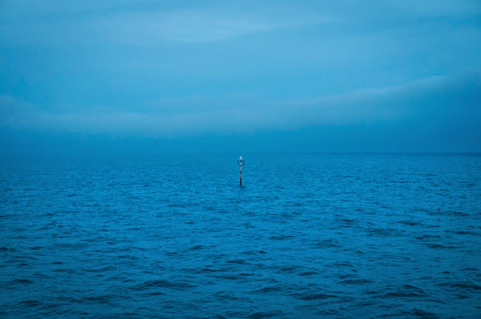

“(where)” –  [Lluís Ribes i Portillo (cc)](http://creativecommons.org/licenses/by-nc-nd/3.0/)

“(who)” –  [Lluís Ribes i Portillo (cc)](http://creativecommons.org/licenses/by-nc-nd/3.0/)

“(what)” –  [Lluís Ribes i Portillo (cc)](http://creativecommons.org/licenses/by-nc-nd/3.0/)

 *“I’ll slip away”*

> And I’ll forget about the girl that said no   
> Then I’ll tell who I want where to go   
> And I’ll forget about your lies and deceit   
> And your attempts to be so discreet   
> Maybe today, yeah   
> I’ll slip away 

> And you can keep your symbols of success   
> Then I’ll pursue my own happiness   
> And you can keep your clocks and routines   
> Then I’ll go mend all my shattered dreams  
> Maybe today, yeah   
> I’ll slip away

> Cause you’ve been down on me for too long   
> And for too long I just put you on   
> Now I’m tired of lying and I’m sick of trying   
> Cause I’m losing who I really am   
> And I’m not choosing to be like them 

> And if you get bored and you got loneliness   
> Or it’s dislike for me you express   
> I won’t care if you’re right or you’re wrong   
> I won’t care cause you see I’ll be gone  
> Maybe today, yeah   
> I’ll slip away

> Maybe today, yeah   
> Maybe today, yeah   
> Maybe today, yeah girl  
> I’ll slip away

*“I’ll slip away”* – [Rodriguez](http://es.wikipedia.org/wiki/Sixto_D%C3%ADaz_Rodr%C3%ADguez) ([youtube videoclip](https://www.youtube.com/watch?v=8tJLY6-WIfI))