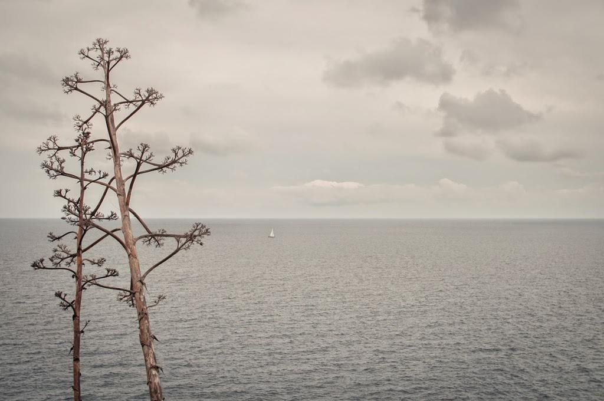

“Camí a Tossa”  –  [Lluís Ribes i Portillo (cc)](http://creativecommons.org/licenses/by-nc-nd/3.0/)

*“**Después de un invierno malo, una mala primavera*

*dime por qué estás buscando una lágrima en la arena”*

[“Soldadito marinero”](https://www.youtube.com/watch?v=GxQjx7FkmNA)– [*Fito & Fitipaldis*](http://es.wikipedia.org/wiki/Fito_%26_Fitipaldis)