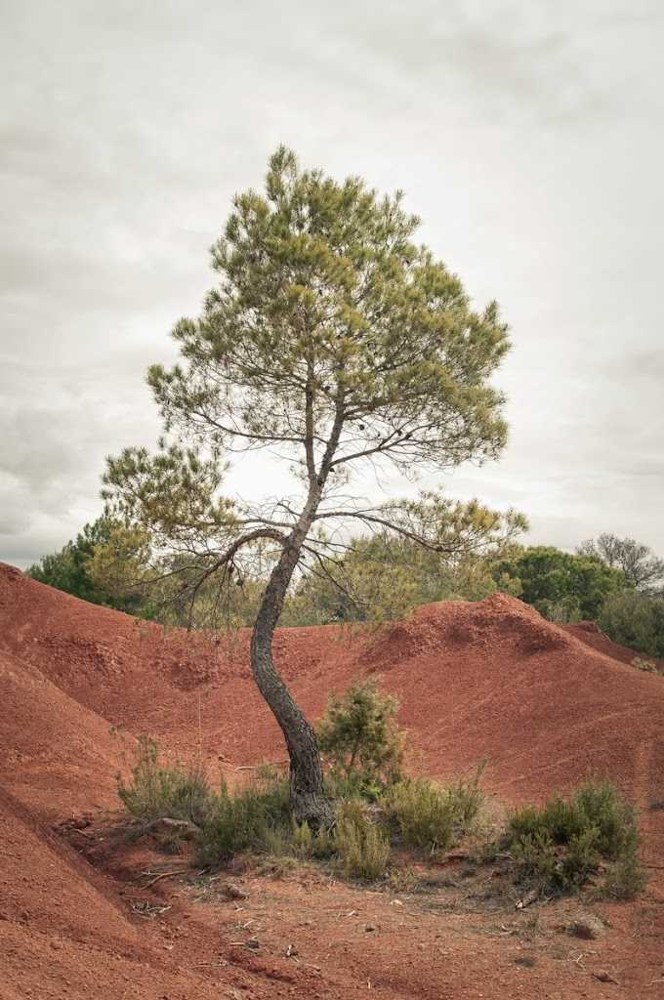

“Continuar endavant”  –  [Lluís Ribes i Portillo (cc)](http://creativecommons.org/licenses/by-nc-nd/3.0/)

*“Hoy, antes del alba, subí a las colinas,*

*miré los cielos apretados de luminarias*

*y le dije a mi espíritu: cuando*

*conozcamos todos estos mundos y el placer y la sabiduría*

*de todas las cosas que contienen,*

*¿estaremos tranquilos y satisfechos?*

*Y mi espíritu dijo: No,*

*ganaremos esas alturas sólo para seguir adelante.”*

[Walt Whitman](http://es.wikipedia.org/wiki/Walt_Whitman)