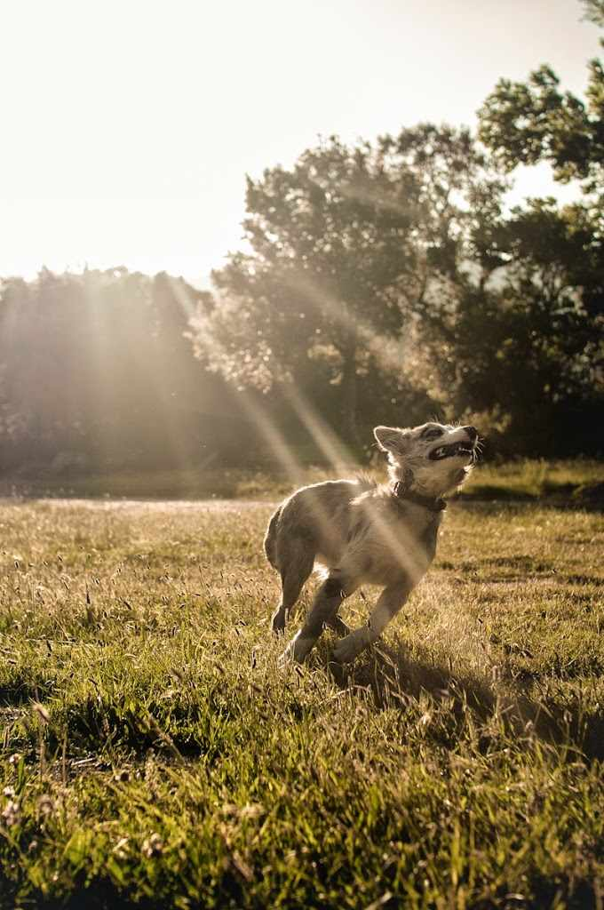

“En memòria als exiliats” (La Vajol, 2014)  –  [Lluís Ribes i Portillo (cc)](http://creativecommons.org/licenses/by-nc-nd/3.0/)

*“Y te daré mi canción:*

*Se canta lo que se pierde*

*con un papagayo verde*

*que la diga en tu balcón”*

*[Antonio Machado](http://es.wikipedia.org/wiki/Antonio_Machado)*