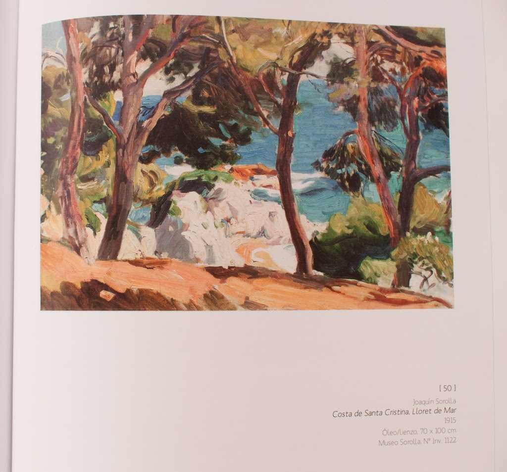
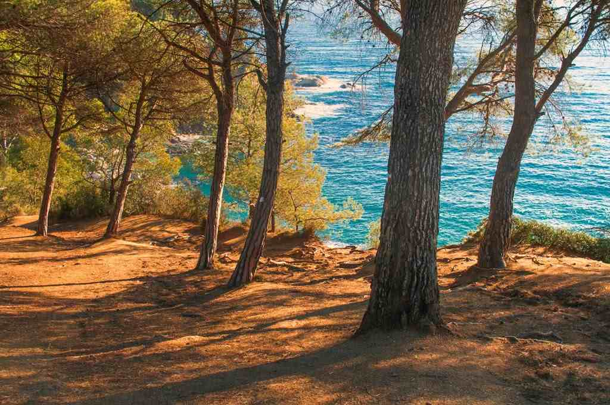
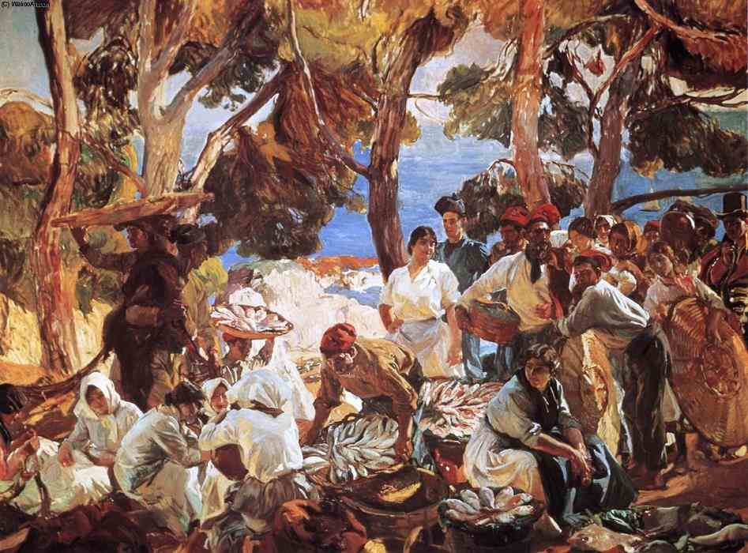

Estoy leyendo el libro de la exposición  [Sorolla – El Color del Mar](http://www.laie.es/grupos/especial-categoria.php?codCategoria=948) del [CaixaForum de Barcelona](http://obrasocial.lacaixa.es/nuestroscentros/caixaforumbarcelona_ca.html) y me topo con la siguiente imagen que me recuerda inmediatamente a unas fotografías que realicé durante [ElPetitViatge](http://elpetitviatge.lluisribes.net/)

“Costa de Santa Cristina Lloret de Mar” – [Sorolla – El Color del Mar](http://www.laie.es/grupos/especial-categoria.php?codCategoria=948) 

Santa Cristina, 2013 –  [Lluís Ribes (cc)](http://creativecommons.org/licenses/by-nc-nd/3.0/)

Algo me pasó parecido con una foto de [Ansel Adams](http://www.anseladams.com/) tal como escribí casi dos años atrás: [http://www.lluisribes.net/?p=135](http://www.lluisribes.net/?p=135). Aunque esta vez hay más coincidencia que casualidad dado que la foto está tomada antes de conocer estas obras de [Joaquín Sorolla](http://es.wikipedia.org/wiki/Joaqu%C3%ADn_Sorolla) y no al revés como pasó con la foto de Ansel Adams.

¿Qué hay de común entre estas dos fotos? Varias cosas, la primera el lugar. Ambas imágenes están realizadas muy cercas la una de la otra. Son las primeras calas de la Costa Brava entre Blanes y Fanals. Entre ellas la de Santa Cristina. Estas calas están protegidas por unos acantilados repletos bosques de pinos que llegan al abismo mismo de las rocas y desde la altura puedes ver la la mar azul en contraste con la tierra y las sombras y claros que proyecta el bosque.

La segunda cosa en común, la intención de registrar, documentar una parte del mundo en el que vivimos. Joaquín Sorolla realizó esta pintura en 1925 para la realización de su obra *Cataluña. El pescado*. Lo registró con pintura usando una técnica impresionista muy madura y encontró en esta zona, la de Santa Cristina, lo que buscaba tal como le escribió a su mujer Clotilde:

*“Santa Cristina es una maravilla: grandes pinos sobre el monte con escolloso claros de color, sobre un mar maravilloso de azul y verde, algo griego, y estupendo”.* 

Nunca más de acuerdo, con mi cámara también quedé culpido de esta potencia, todavía más si cabe después de estar durante tres días caminando toda la costa del Maresme que parecía una mar en calma en comparación a este rincón de gran fuerza y un oleaje de colores y contrastes que enguyen al navegante casual remetiéndome a las palabras del poeta [Joan Maragall](http://es.wikipedia.org/wiki/Joan_Maragall) que escribió el siguiente fragmento en su poema “Vistes al mar”:

*“\[…\]*

*Dues coses hi ha*

 *que al mirar-les juntes me fa el cor més gran:*

  *la verdor dels pins,* 

*la blavor del mar*“

La pintura de Joaquín Sorolla me encanta. Ver sus lienzos, sus trazos y sus colores me enamora. Entender y conocer su trayectoria, su época y su aprendizaje me entusiasma y tan solo tengo que decir qué lujo disfrutar y aprender de los maestros.

“Cataluña. El pescado.” Joaquín Sorolla