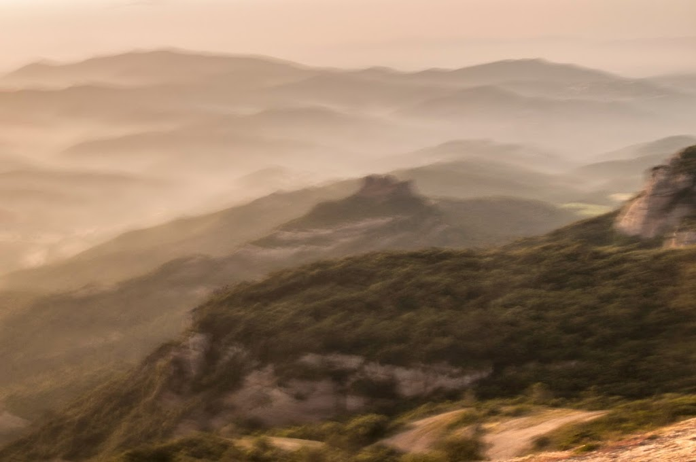
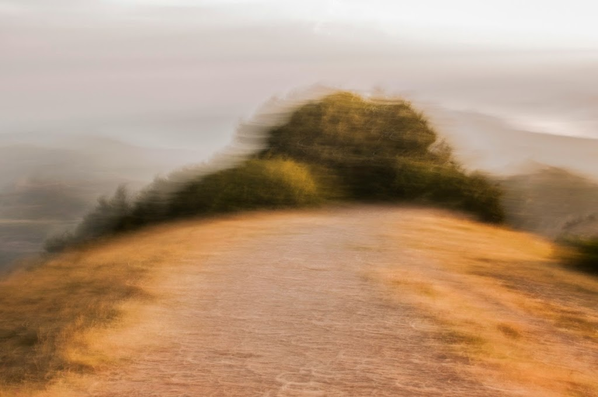
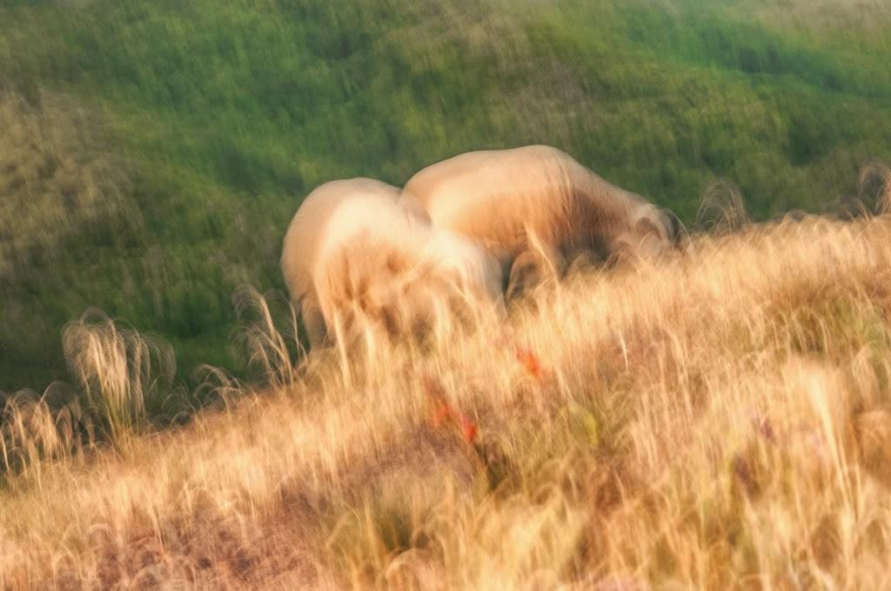

Hoy he realizado un ejercicio de fotografía. Tras visitar la exposición de [Joaquín Sorolla en el CaixaForum](http://obrasocial.lacaixa.es/nuestroscentros/caixaforumbarcelona/sorolla_ca.html) he querido practicar la toma de imágenes de tal forma que capte como protagonista los colores y las formas eliminando el detalle del motivo.

La manera de afrontar el ejercicio ha sido buscando la luz suave de la mañana que me permite captar imágenes con una exposición larga (entre 1/2 sg y 1/10 sg) sin usar filtros, trazar como si de un pintor se tratara los trazos con un leve movimiento de muñeca al apretar el obturador y sobretodo captar unas tonalidades amarillas en las luces que pinta la fotografía entera.

El escenario, la montaña del [Montcau](http://es.wikipedia.org/wiki/El_Montcau), es un excelente mirador del país y de acceso muy fácil por el puerto de Estenalles. Importante teniendo en cuenta que el sol salía a las 06:20 horas.

La primera imagen, es la vista hacia el este. El sol está comenzando a salir de entre las montañas pero queda fuera de la composición. Las nieblas cubren el paisaje que tiene una tonalidad muy apagada a excepción de la roca del primer plano que refleja la primera luz de la mañana amarilla en la misma roca y en algunos brillos de la vegetación.

Ejercicio I Vistas al este – [Lluís Ribes (cc)](http://creativecommons.org/licenses/by-nc-nd/3.0/)

La segunda imagen es una foto del arbusto que está arriba del monte del Montcau. La mañana avanza y el sol ilumina la cima. La hierba seca dibuja el amarillo y el camino nos conduce al arbusto que es pintado con tonalidades verdes y brillos amarillos. Desgraciadamente el fondo que son las montañas lejana y el cielo no puedo obtner nada notable.

Ejercicio II El arbusto – [Lluís Ribes (cc)](http://creativecommons.org/licenses/by-nc-nd/3.0/)

[En este enlace](https://www.flickr.com/photos/lluisr/8525769924/in/photolist-bgkWwD-dZoNnb-b9benp-bgkXHx-bgJhcH) podéis ver el arbusto en cuestión pero desde el lado opuesto y usando otra técnica fotográfica más clásica de registro.

Finalmente la siguiente fotografía. Aparecieron un par de ovejas, que tal como me comentó un caminante que me encontré arriba acostumbran a subir a primera hora cuando no hay nadie (el Montcau es una cima que se llena de gente durante el día) para pastar la hierba fresca. Casualidad o no, estoy allí y las enregistro con la cámara de fotos. 

Ejercicio III Las ovejas – [Lluís Ribes (cc)](http://creativecommons.org/licenses/by-nc-nd/3.0/)  

Esta fotografía está ligeramente reencuadrarda para eliminar un poco de cielo que aparecía arriba y no me parecía interesante. De esta forma, las ovejas quedan enmarcadas entre el pasto de la cima y el fondo verde del monte próximo al Montcau. Para mi es una hermosa fotografía, toda ella está dibujada con los trazos del movimiento a la hora de apretar el obturador, los colores captan la primera hora del día que también tiñe la piel de la oveja y las pocas manchas rojas nos recuerdan que hizo poco que pasó la primavera por aquí.