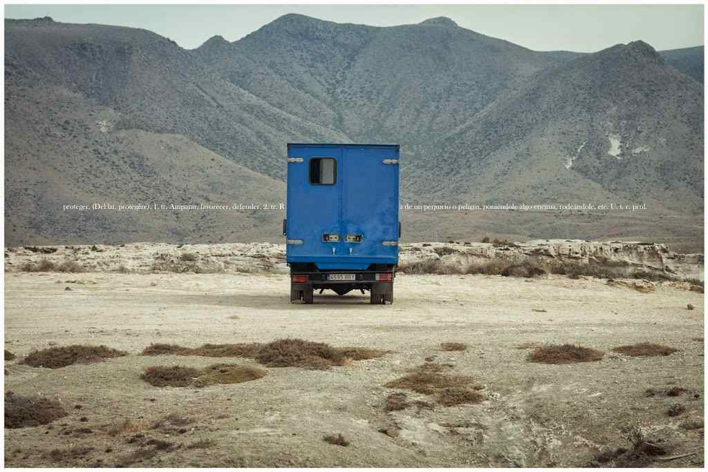
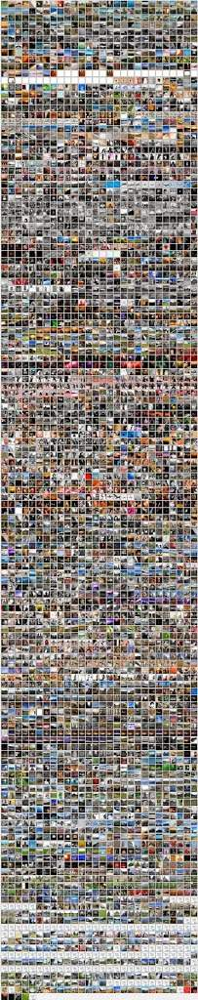

*“En un lugar de Almería… (deconstrucción flickr)”* – [Lluís Ribes i Portillo (cc)](http://creativecommons.org/licenses/by-nc-nd/3.0/)

Hoy cierro de forma indefinida la visualización de las fotografías de [mi cuenta en Flickr](http://flickr.com/lluisr): a la práctica un cierre de la galería.

Desde 2005 se han compartido más de 4000 fotografías, pero llegados a este punto ya no encuentro más sentido hacerlo.

Me guardo los detalles con los que he vuelto de [los talleres de Cabo de Gata](http://www.talleresencabodegata.com/) que me han hecho tomar esta decisión, pero giran alrededor del ruido que me generan y como dijo el profesor, basta ya de ejercicios. Así pues las guardo todas en un camión, azul, para protegerlas del desierto.

Ahora toca rehacer los enlaces a las fotos que complementaban algunos artículos en este blog y arreglar otras consecuencias técnicas surgidas a raíz de esta acción.

Como curiosidad os adjunto una retícula (más bien una falsa retícula porque no podemos acercarnos a ella y ver en detalle cada imagen..) de todas las fotos que tenía en la cuenta de [flickr.com](http://flickr.com/lluisr):

*“Retícula http://flickr.com/lluisr”* – [Lluís Ribes i Portillo (cc)](http://creativecommons.org/licenses/by-nc-nd/3.0/)

¡Gracias!