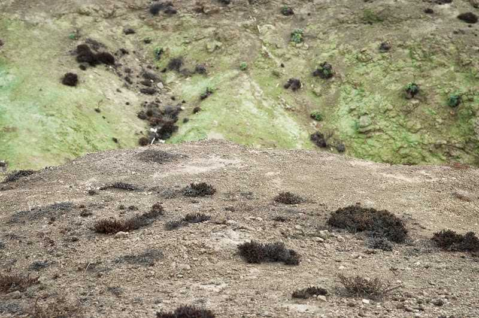

*“Perdre’s”* – [Lluís Ribes i Portillo (cc)](http://creativecommons.org/licenses/by-nc-nd/3.0/)

*“Perderse significa que entre nosotros y el espacio no existe solamente una relación de dominio, de control por parte del sujeto, sino también la posibilidad de que el espacio nos domine a nosotros. Son momentos de la vida en los cuales empezamos a aprender del espacio que nos rodea.* *\[…\]* *En las culturas primitivas, por el contrario, si alguien no se pierde no se vuelve mayor. Y este recorrido tiene lugar en el desierto, en el campo. Los lugares se convierten en una especie de máquina a través de la cual se adquieren nuevos estados de consciencia”.* 

La Cecla, Franco; Perdersi, l’uomo senza ambiente. Ed. Laterza, Bari, 2000.