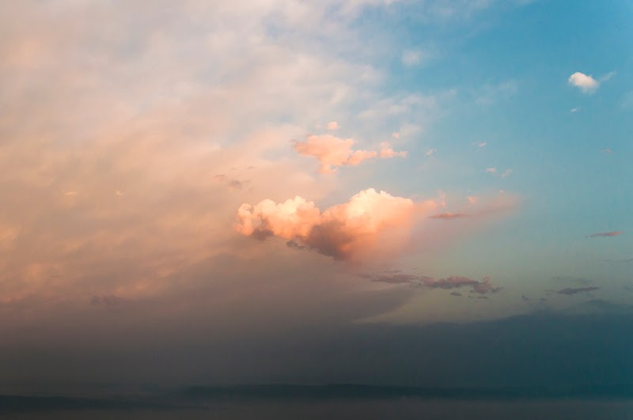

*“Núvol que marxa”* – [Lluís Ribes i Portillo (cc)](http://creativecommons.org/licenses/by-nc-nd/3.0/)

“Los paseos son como nubes. Vienen y se van”

[Hamish Fulton](http://es.wikipedia.org/wiki/Hamish_Fulton)