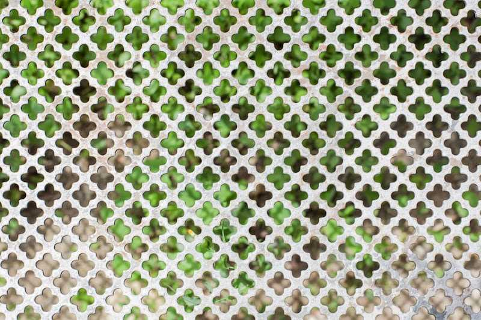

*“La ciutat”* – [Lluís Ribes i Portillo (cc)](http://creativecommons.org/licenses/by-nc-nd/3.0/)

> “Nos liberamos de convicciones postizas y empezamos a recordar que el espacio es una invención fantástica con la que se puede jugar, como cuando éramos niños. Hay un refrán que guía nuestras caminatas: ‘**Quien pierde tiempo gana espacio**‘. \[…\] Hay que aprender a perder tiempo, a no buscar el camino más corto, a dejarse guiar por los acontecimientos, a dirigirse hacia calles inaccesibles en las que sea posible “tropezar” y, ojalá, detenerse a hablar con las personas que encontramos, o saber detenerse olvidándonos de proseguir: saber alcanzar el andar sin intención, el andar indeterminado.” 

> “[WALKSCAPES. El Andar Como Práctica Estética](http://ggili.com/es/tienda/productos/walkscapes-1)” – [Francesco Careri](http://ggili.com/es/autores/francesco-careri)