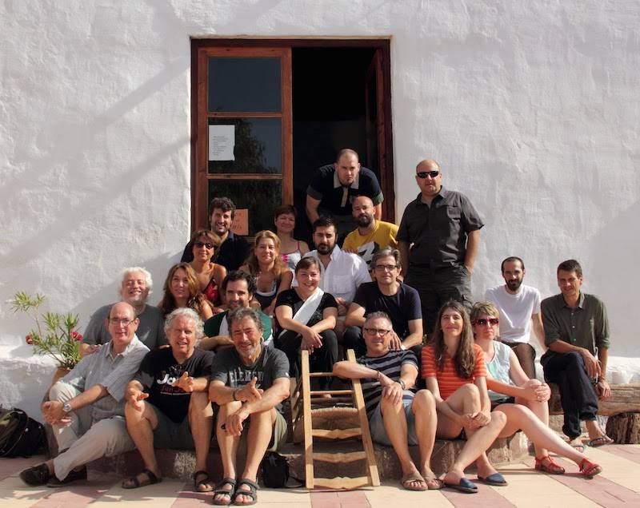
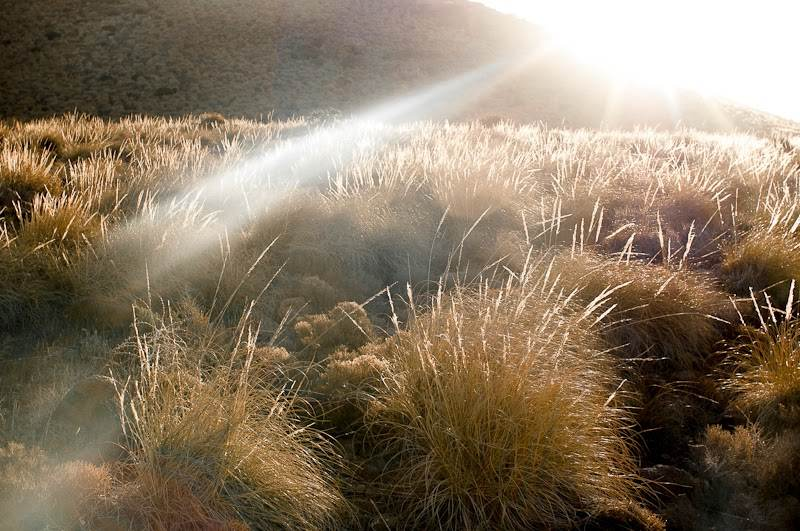

Un recuerdo del [taller de Cabo de Gata](http://www.talleresencabodegata.com/) “Territorialidades” con [Xavier Ribas](http://www.xavierribas.com/), la de los compañeros porque ellos son todo en estos talleres:

*Néstor, Pedro, Murielle, Óscar, Juanjo, Juani, Pilar, Rubén, Agustín, Ramón, Elena, José María, Catarina, Javier, Xavier, Alejandro, Manolo, Óscar, Mercedes, Christine y la silla.*

Aunque hizo sol todos los días hubo muchas nubes, nubes de ideas, nubes de historias, nubes de chistes, nubes de fotos, nubes de amistad y como no la nube del regreso. Podéis leer aquí a que me refiero con ello: [Nube del regreso – ibericadenubes](http://ibericadenubes.blogspot.com.es/2013/07/65-nube-del-regreso.html?q=gata)