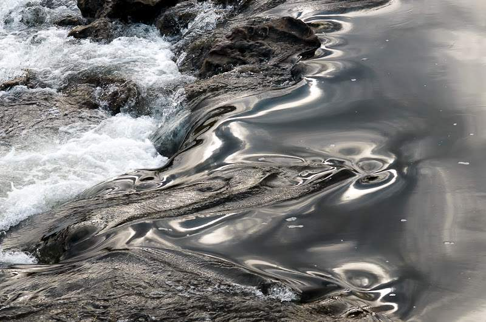

*“Obstacle”* – [Lluís Ribes i Portillo (cc)](http://creativecommons.org/licenses/by-nc-nd/3.0/)

\[…\]

when you look at water

you see what you think is your reflection,

but it’s not yours,

you are a reflection of water.

[Roni Horn](http://en.wikipedia.org/wiki/Roni_Horn)

—

\[…\]

cuando te fijas en el agua

ves lo que piensas que es tu reflejo,

pero no es el tuyo,

tú eres un reflejo del agua.

[Roni Horn](http://en.wikipedia.org/wiki/Roni_Horn)