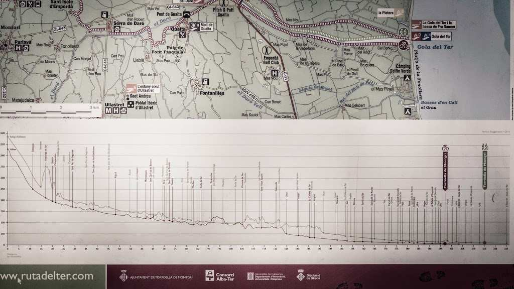

Un any enrere vaig trobar aquest panell informatiu durant [elpetitviatge](http://elpetitviatge.lluisribes.net/): 

Qui ho hagués dit que avui començaria un viatge que farà el recorregut d’aquest panell: Des de la Gola del Ter a Ulldeter, des de la mar fins a la muntanya, des de l’eternitat del riu fins al seu primer bateg.

De moment tant sols caminaré fent fotos per un projecte en concret amb la càmara… però aniré pujant imatges i coses que trobi durant el camí al meu twitter: [http://twitter.com/lluisribes](http://twitter.com/lluisribes) i al hashtag [#mirarelriu](https://twitter.com/hashtag/mirarelriu?f=realtime&src=hash)

Bona diada!