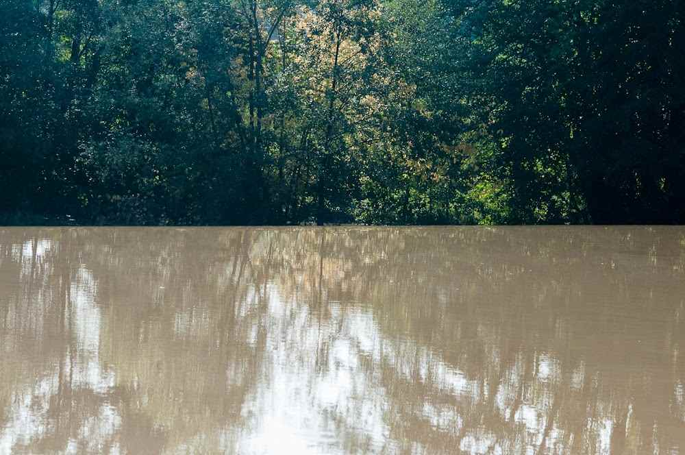
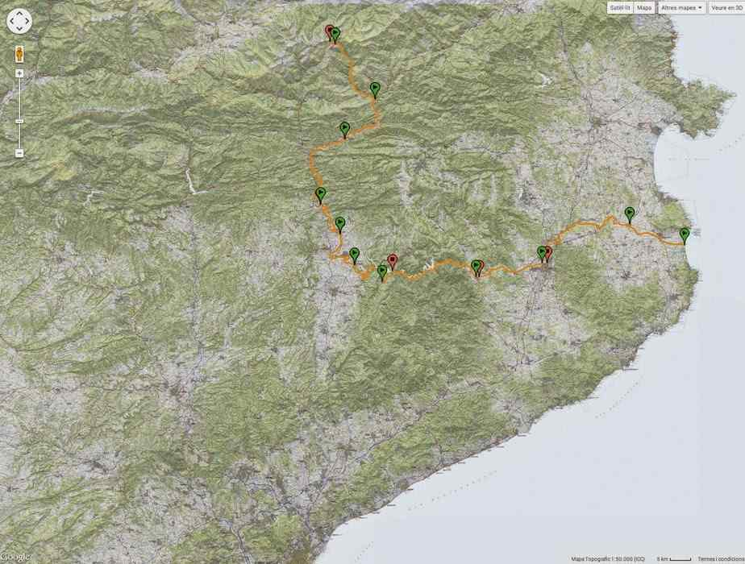

*“El riu Ter pel seu pas de Roda de Ter”* – [Lluís Ribes i Portillo (cc)](http://creativecommons.org/licenses/by-nc-nd/3.0/)

Ja es pot consultar les 11 etapes de **MirarElRiu: la travessa Gola de Ter – Ulldeter a peu** realitzat entre les dates d’11 de setembre i 21 de setembre de 2014.  
Tota la informació s’ha pujat a la web [Wikilocs](http://ca.wikiloc.com/wikiloc/user.do?id=934671), a on podreu:

-   Veure el recorregut de l’etapa sobre diversos tipus de mapes
-   Descarregar el recorregut pel vostre dispositiu GPS o al Google Earth
-   Visualitzar el perfil de l’etapa
-   Una breu descripció amb apunts a tenir en compte de l’etapa
-   A on es va dormir
-   Enllaç a l’anterior i següent etapa per una navegació fàcil
-   6 fotografies realitzades per cada etapa
-   Comentaris

A continuació s’adjunta la llista d’enllaços a les 11 etapes amb la informació a Wikilocs:

-   [Gola del Ter – Verges (1ª etapa Travessa El Ter)](http://ca.wikiloc.com/wikiloc/view.do?id=7871617)
-   [Verges – Girona (2ª etapa Travessa el Ter)](http://ca.wikiloc.com/wikiloc/view.do?id=7872506)
-   [Girona – Anglès (3ª etapa Travessa el Ter)](http://ca.wikiloc.com/wikiloc/view.do?id=7877544)
-   [Anglès – Pantà de Sau (4ª etapa Travessa el Ter)](http://ca.wikiloc.com/wikiloc/view.do?id=7897101)
-   [Pantà de Sau – Roda de Ter (5ª etapa Travessa el Ter)](http://ca.wikiloc.com/wikiloc/view.do?id=7899236)
-   [Roda de Ter – Torelló (6ª etapa Travessa el Ter)](http://ca.wikiloc.com/wikiloc/view.do?id=7906923)
-   [Torelló – Sant Quirze de Besora (7ª etapa Travessa el Ter)](http://ca.wikiloc.com/wikiloc/view.do?id=7912504)
-   [Sant Quirze de Besora – Sant Joan de les Abadesses (8ª etapa Travessa el Ter)](http://ca.wikiloc.com/wikiloc/view.do?id=7912519)
-   [Sant Joan de les Abadesses – Camprodon (9ª etapa Travessa el Ter)](http://ca.wikiloc.com/wikiloc/view.do?id=7919541)
-   [Camprodon – Ulldeter (10ª etapa Travessa el Ter)](http://ca.wikiloc.com/wikiloc/view.do?id=7919544)
-   [Refugi Ulldeter – Naixement riu Ter (Darrera etapa Travessa el Ter)](http://ca.wikiloc.com/wikiloc/view.do?id=7940086)

Detall del recorregut sobre mapa de la travessa MiraElRiu: Gola de Ter – Ulldeter a peu