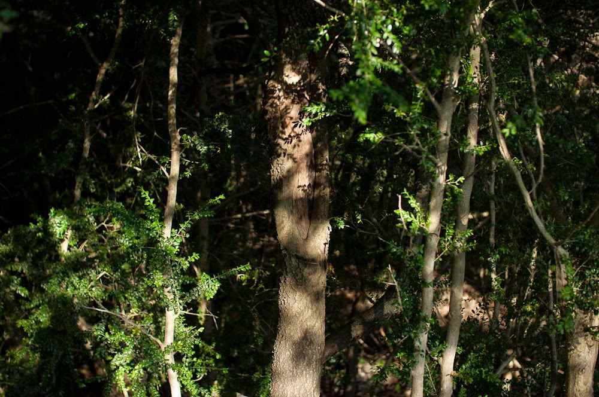

*“Arbre al bosc”* – [Lluís Ribes i Portillo (cc)](http://creativecommons.org/licenses/by-nc-nd/3.0/)

“Pain is a natural part of life.

Learn to accept it.

Learn to take care of it

as best you can.

Decrease the complaining.

Decrease the self-centeredness around it.

Everybody has pain.

Breathe and relax

into the pain

as best you can.

Please accept natural pain!“

“*Buddha In Blue Jeans*” by [Tai Sheridan](https://twitter.com/TaiSheridan)