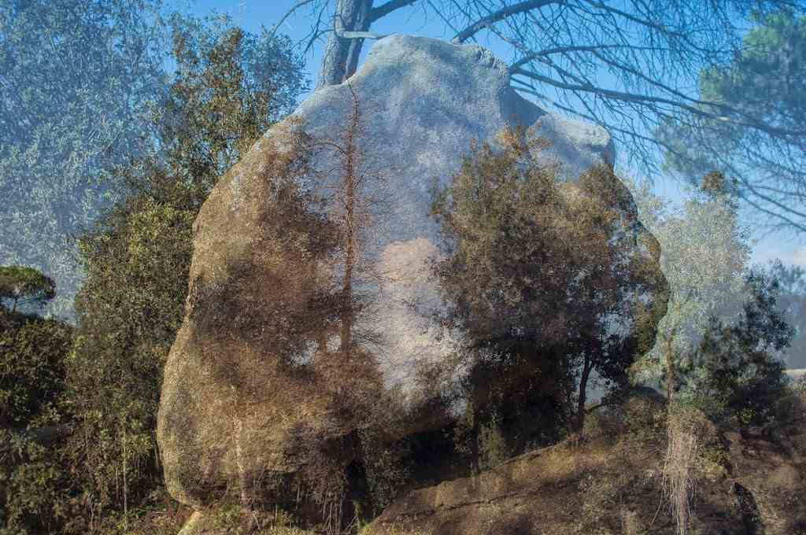

*“El somni de la roca”* – [Lluís Ribes i Portillo (cc)](http://creativecommons.org/licenses/by-nc-nd/3.0/)

Avui m’ha passat una història sorprenent caminant. Molt a prop de les roques de Céllecs m’he trobat amb aquesta. Li he preguntat que feia mirant el cel alhora que li demanava permís per fer-li una foto i m’ha respòs que somiava… somiava a ser núvol.

Amb el seu permís pujo la foto al meu blog.

Bona setmana!