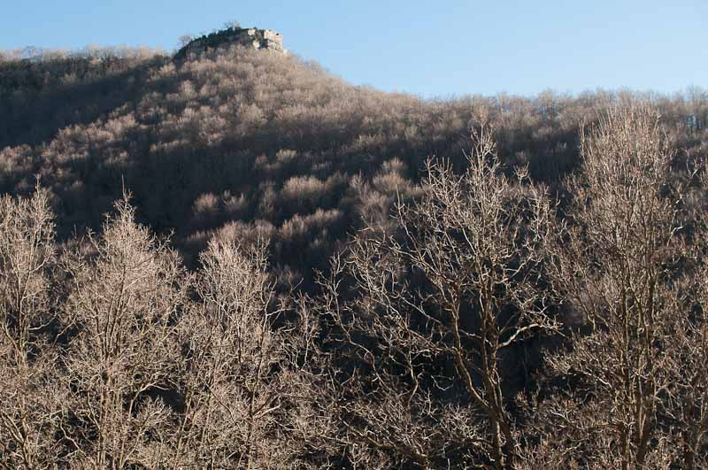

<figure id="attachment_2697" aria-describedby="caption-attachment-2697" style="width: 790px"><figcaption id="caption-attachment-2697">“Morro del Quer” – <a href="http://creativecommons.org/licenses/by-nc-nd/3.0/" target="_blank" rel="noopener noreferrer">Lluís Ribes i Portillo (cc)</a></figcaption></figure>

> ### “Cuando pierdes, no pierdes la lección”

  [Dalái Lama](http://es.wikipedia.org/wiki/Dal%C3%A1i_Lama "Dalái Lama")