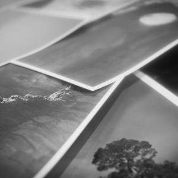
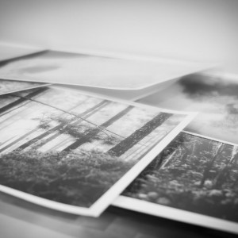

\[columns\]  
\[column width=”one-half”\]  
  
\[/column\]  
\[column width=”one-half”\]  
  
\[/column\]  
\[/columns\]  
El 28 de Enero dentro del año dedicado al fotógrafo [Pere Formiguera](http://www.pereformiguera.com/ "Web Pere Formiguera") en Sant Cugat del Vallés expondré fotografías de [ATLÁNTICA](http://www.lluisribes.net/atlantica/ "Web ATLÁNTICA") en la exposición *“Mostra de fotografia d’autor”*  
Ayer las puse a disposición de la organización para su enmarcación y preparación en la sala de la Casa de Cultura de Sant Cugat. En esta sala todavía podéis visitar la exposición “Els amics i companys de Pere Formiguera” muy recomendable con fotos de Mariano Zuzunaga, Manel Úbeda, Manel Esclusa, Joan Fontcuberta y Rafael Navarro ([podéis ver aquí unas imágenes](https://www.facebook.com/1433711293549054/photos/pb.1433711293549054.-2207520000.1421197039./1530961510490698/?type=1&theater)).  
Estas exposiciones y otras actividades como son mesas redondas y conferencias en el marco del Any Pere Formiguera están organizadas por [QGat-Foto](https://www.facebook.com/pages/Qgat-Foto/1433711293549054 "Facebook de QGat Foto")