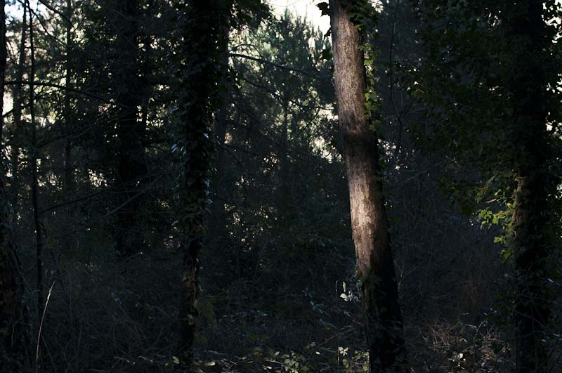

<figure id="attachment_2715" aria-describedby="caption-attachment-2715" style="width: 790px"><figcaption id="caption-attachment-2715">“Arbre de camí a Milany” – <a href="http://creativecommons.org/licenses/by-nc-nd/3.0/" target="_blank" rel="noopener noreferrer">Lluís Ribes i Portillo (cc)</a></figcaption></figure>

> ### “Pintar la naturaleza no es copiar un objeto es la realización de una sensación”

[Paul Cezanne](http://es.wikipedia.org/wiki/Paul_C%C3%A9zanne "Paul Cezanne")