[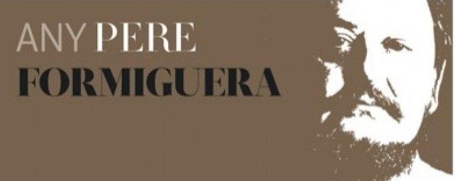](http://www.lluisribes.net/wp-content/uploads/2015/01/cartell-any-formiguera-260471-e1421800183122.jpg)

**El 28 de Enero se inaugura la exposición “Fotografia d’autor”** dentro del marco de los eventos que se realizan del [año Pere Formiguera en Sant Cugat del Vall](http://www.santcugat.cat/web/any-pereformiguera "Any Pere Formiguera")ès.

Quiero presentaros en este artículo a los 7 fotógrafos, con su obra, que vamos a participar. Artistas muy ligados a la ciudad de Sant Cugat que tienen en la fotografía un medio común de expresión y pasión como lo fue con Pere Formiguera.

Aquí van los fotógrafos de la expo:

**Jordí Camí**

con el proyecto *“**Beirut, Rebuilding Dreams**“* nos mostrará una serie de 15 fotografías de una ciudad que la define como un lugar de contrastes brutales, esquizofrénica que le seduce y provoca a la vez. Fotografía contemporánea de un lugar límite por una mirada de un fotógrafo que ha trabajado intensamente en el fotoperiodismo.

Las fotografías en color tendrán una dimensión de 70 cm por 50 cm.

   

<figure id="attachment_2723" aria-describedby="caption-attachment-2723" style="width: 790px">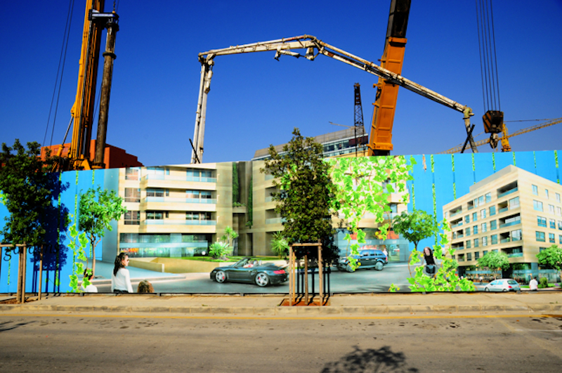<figcaption id="caption-attachment-2723">© Jordi Camí</figcaption></figure>

  

<figure id="attachment_2722" aria-describedby="caption-attachment-2722" style="width: 790px">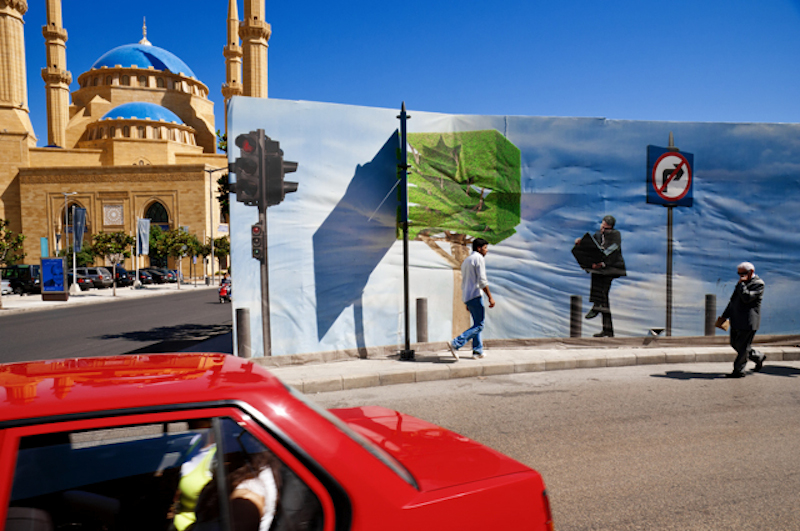<figcaption id="caption-attachment-2722">© Jordi Camí</figcaption></figure>

  
En este blog podéis conocer más sobre el autor [http://cargocollective.com/jordicami](http://cargocollective.com/jordicami "Jordí Camí - Fotografía")

* * *

**Llorenç Pie**

mostrará el proyecto “***Minimals***” con 10 fotografías pictóricas, abstractas, cálidas y que guardan una gran coherencia entre ellas que como él dice es una característica que le ha marcado mucho en su obra fotográfica a raíz de unas palabras que el mismo Pere Formiguera le “regaló” años atrás. Tengo ganas de ver esas fotografías impresas con todo su colorido. Como dedicatoria a Pere Formiguera, expondrá una fotografía más llamada “*Alegría*“

<figure id="attachment_2729" aria-describedby="caption-attachment-2729" style="width: 790px">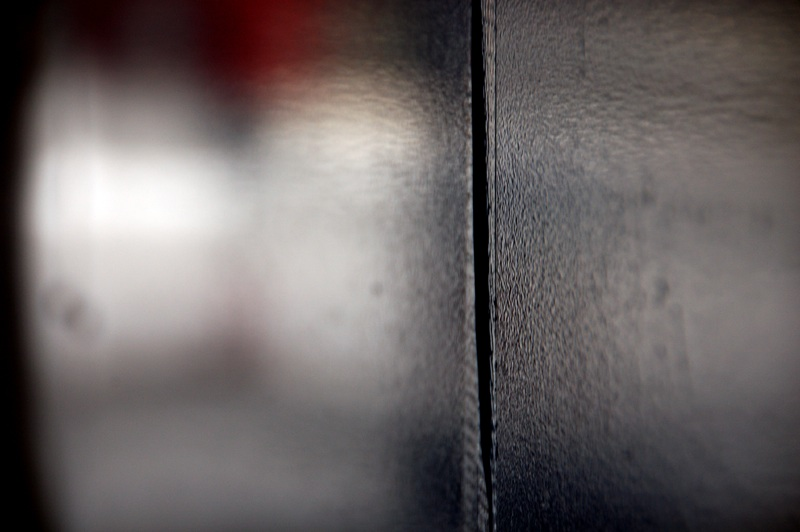<figcaption id="caption-attachment-2729">@ Llorenç Pie</figcaption></figure>

  

<figure id="attachment_2728" aria-describedby="caption-attachment-2728" style="width: 522px">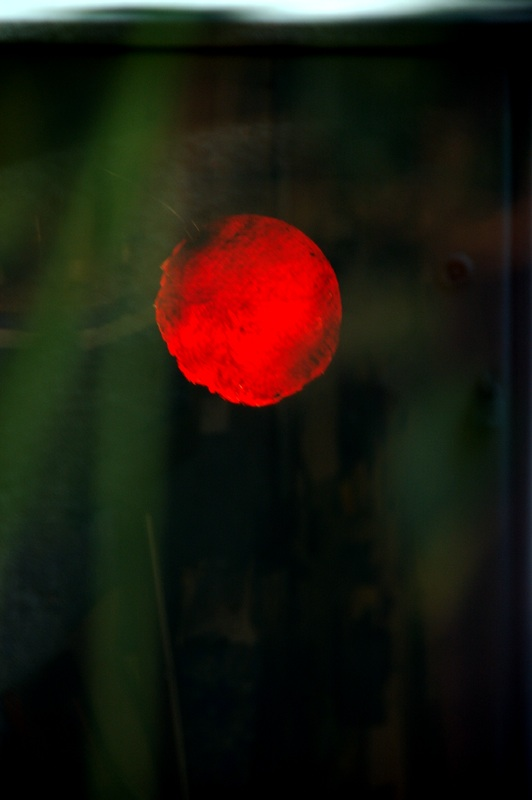<figcaption id="caption-attachment-2728">© Llorenç Pie</figcaption></figure>

Podéis visitar su página web en [http://www.fotoart-llorens.com/](http://www.fotoart-llorens.com/ "Llorenç Pie - Fotografía")

* * *

**Maite Llasera y Joan Roig**

expondrán el proyecto “***Journal Lia Gabashbili***“, un viaje al pasado de una mujer que ha reconducido su vida varias veces y quiere tener un momento en su vida para las personas que han formado parte de ella. Las fotografías, en color, estarán expuestas en un gran formato de 100 cm por 70 cm. que permitirá ver la gran cantidad de detalles que estas fotos esconden en ellas. Me recuerdan a fotos de Joel Sternfeld, uno de los grandes de hoy en día.

<figure id="attachment_2724" aria-describedby="caption-attachment-2724" style="width: 790px">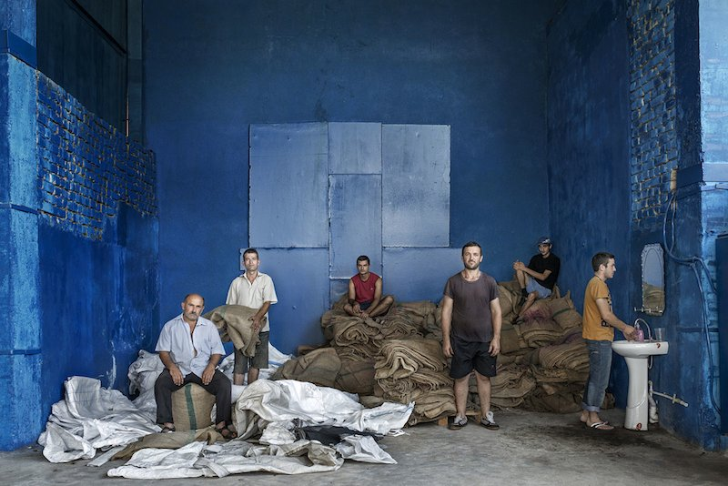<figcaption id="caption-attachment-2724">@M. Llasera – J. Roig</figcaption></figure>

  

<figure id="attachment_2725" aria-describedby="caption-attachment-2725" style="width: 790px">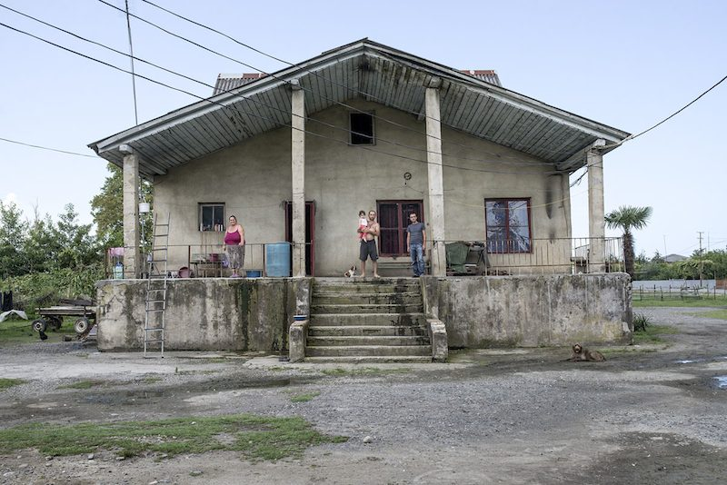<figcaption id="caption-attachment-2725">© M. Llasera – J. Roig</figcaption></figure>

  
Podéis visitar la obra de esta pareja de artistas en su web [http://www.roigllasera.com/](http://www.roigllasera.com/ "Maite Llasera y Joan Roif - Fotografía")

* * *

**Miquel Abat**

presentará fotografías de su proyecto “***En Via Morta***” que habla de los espacios vacíos y abandonados a partir de fotografías realizadas en la estación de tren de Canfranc. Es un diálogo con la ausencia y el recuerdo. Pude participar en la impresión de ellas pudiendo disfrutar así de los detalles de estas.

<figure id="attachment_2727" aria-describedby="caption-attachment-2727" style="width: 790px">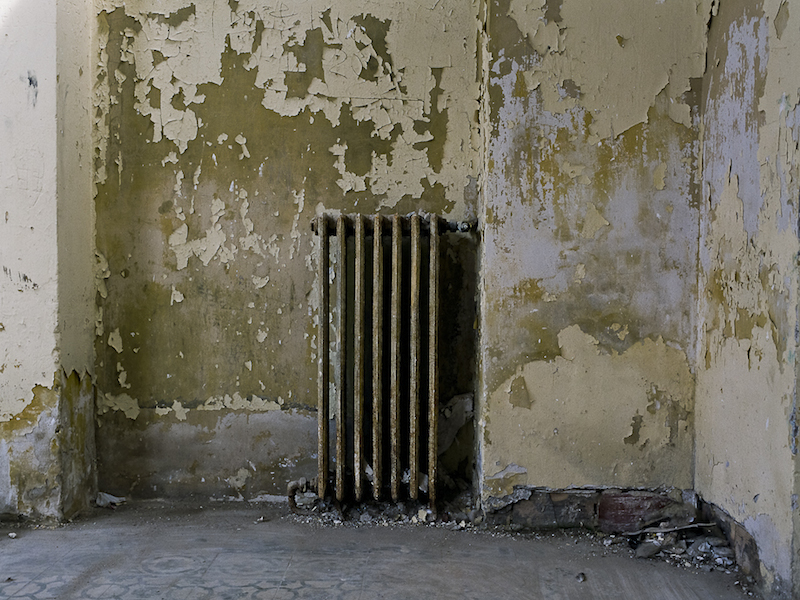<figcaption id="caption-attachment-2727">© Miquel Abat</figcaption></figure>

  

<figure id="attachment_2726" aria-describedby="caption-attachment-2726" style="width: 790px">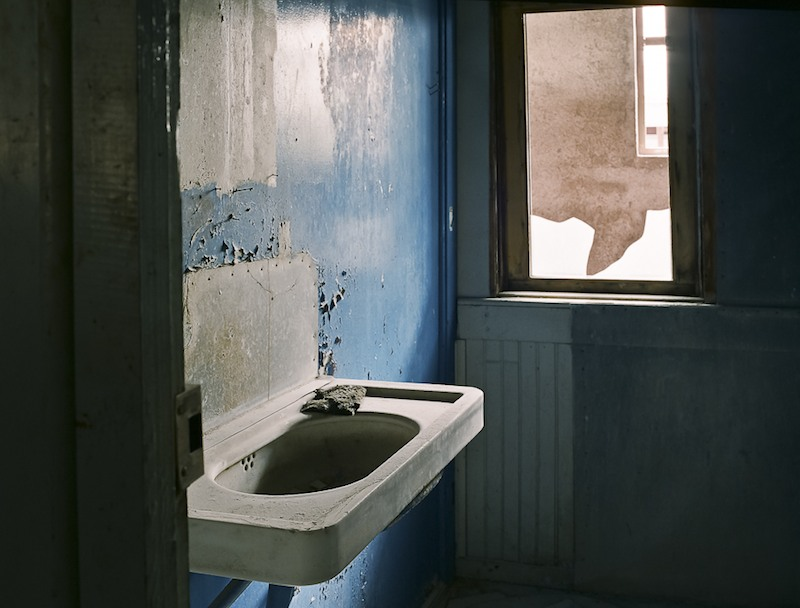<figcaption id="caption-attachment-2726">© Miquel Abat</figcaption></figure>

  
Esta obra ha viajado por numerables festivales y podéis visitar el blog del autor aquí [http://melabat.blogspot.com.es/](http://melabat.blogspot.com.es/ "Miquel Abat - Fotografía")

* * *

**Carles Cabanas**

fotógrafo de la ciudad y escritor nos mostrará “***Altres Realitats***” una serie de fotografías donde el concepto se impone a las formas creando otras realidades. He tenido la oportunidad de realizar una pequeña edición de estas fotografías y me he encontrado con un técnica impecable en la captura de los detalles. Algunas de las fotos me fascinan.

<figure id="attachment_2721" aria-describedby="caption-attachment-2721" style="width: 790px">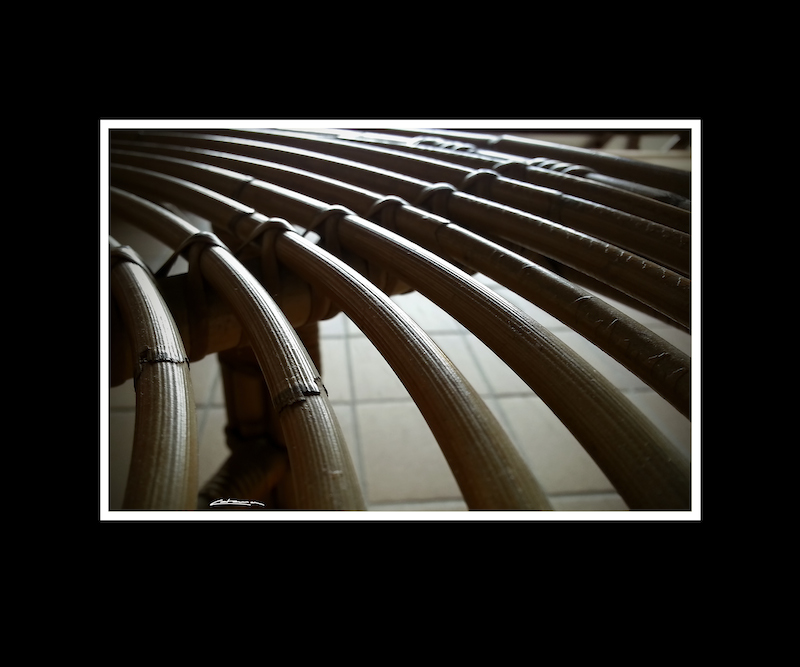<figcaption id="caption-attachment-2721">@Carles Cabanas</figcaption></figure>

  

<figure id="attachment_2720" aria-describedby="caption-attachment-2720" style="width: 790px">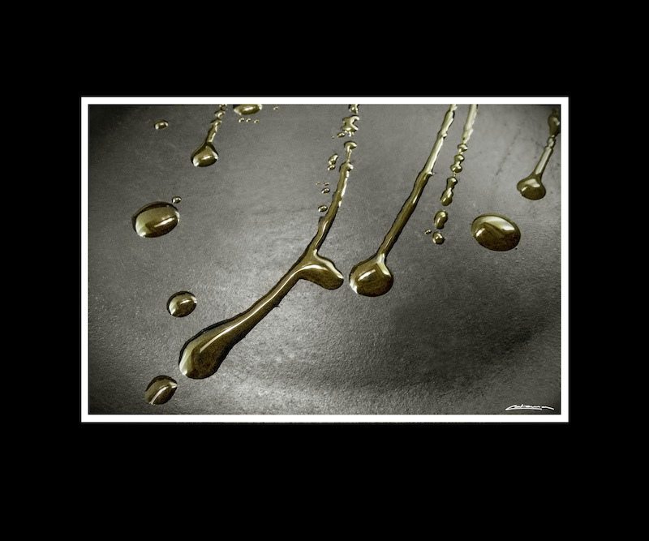<figcaption id="caption-attachment-2720">© Carles Cabanas</figcaption></figure>

Tiene una web con una gran cantidad de fotgrafía en [http://carlescabanas.wix.com/carles-cabanas](http://carlescabanas.wix.com/carles-cabanas "Carles Cabanas - Fotografía")

* * *

**Lluís Ribes i Portillo**

expongo 10 fotografías de mi trabajo “**Atlántica**“. Fotografías en blanco y negro de naturaleza de una isla bella e intrigante… Hay cuatro fotografías nuevas respecto a las que expuse ya hace un año en el Círculo de Bellas Artes de Madrid y estoy entusiasmado en el formato que se presentarán aquí, en 48cm x 32 cm enmarcados en un marco de nogal e impresas en mi laboratorio.

<figure id="attachment_2731" aria-describedby="caption-attachment-2731" style="width: 790px"><a href="http://www.lluisribes.net/wp-content/uploads/2015/01/Atlantica-Lluis_Ribes_i_Portillo.jpg">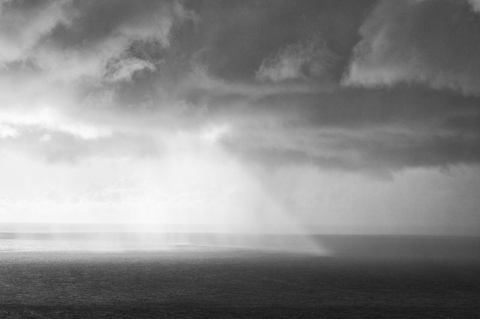</a><figcaption id="caption-attachment-2731">© Lluís Ribes i Portillo</figcaption></figure>

  

<figure id="attachment_2730" aria-describedby="caption-attachment-2730" style="width: 790px"><figcaption id="caption-attachment-2730">© Lluís Ribes i Portillo</figcaption></figure>

  
Podéis visitar la web del proyecto aquí: [http://www.lluisribes.net/atlantica](http://www.lluisribes.net/atlantica "Atlántica")

* * *

**Pep Pujol**  
presenta una fotografía de su colección, una fotografía en blanco y negro del **retrato de una mujer en la cocina**. Una fotografía con una gran fuerza de sombras y luces, matices y detalles.  
 

Como os he comentado **la inauguración se hará el miércoles 28** en la Casa de Cultura de Sant Cugat (detrás del Monasterio de Sant Cugat) y tan pronto como sepa la hora os la haré saber. Estará más de un mes expuesta, hasta el 15 de marzo. Será una buena oportunidad para ver fotografía de autor, más de 60 fotografías en una sala que se ha habilitado para la exposición de obra artística. Si vives en Sant Cugat no dudes en aproximarte para tener un bonito encuentro con la fotografía y si no vives en ella es una buena excusa para bajar un rato y ver la exposición, darte un vuelta por toda la zona peatonal, desde el Monasterio, pasando por el Carrer Major (me acuerdo de la desaparecida librería Jordi) el Carrer Santamaría, la estación… ¡Qué recuerdos! ¡Qué bonito que está y agradable es el paseo!

Por último comentaros que esta exposición está impulsada y organizada por la [asociación fotográfica de Qgat-Foto](https://www.facebook.com/pages/Qgat-Foto/1433711293549054 "Asosiació Fotogràfica Qgat-Foto"). Podéis visitar su facebook y tener la última hora de este evento y de otros [en su página facebook](https://www.facebook.com/pages/Qgat-Foto/1433711293549054).