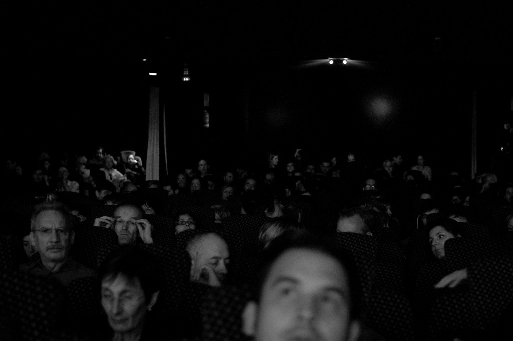
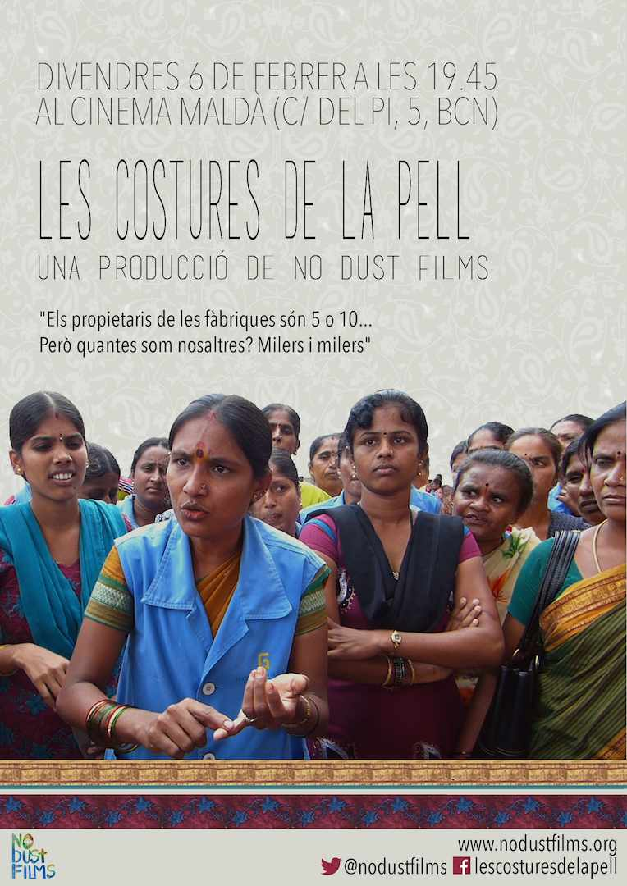

<figure id="attachment_2758" aria-describedby="caption-attachment-2758" style="width: 790px"><figcaption id="caption-attachment-2758">“Cinema” – – <a href="http://creativecommons.org/licenses/by-nc-nd/3.0/" target="_blank" rel="noopener noreferrer">Lluís Ribes i Portillo (cc)</a></figcaption></figure>

El día 6 de febrero ¡Todos al cine! Preestreno del documental [“Las Costuras de la Piel”](http://www.verkami.com/projects/10217-les-costures-de-la-pell) en los cines Maldà de Barcelona a las 19:45.
-----------------------------------------------------------------------------------------------------------------------------------------------------------------------------------------------------

  
Más información:

-   [Les costures de la Pell – web oficial](http://www.nodustfilms.org/es/el-viernes-6-de-febrero-venid-a-las-costuras-de-la-piel/)
-   [Proyecto Verkami](http://www.verkami.com/projects/10217-les-costures-de-la-pell)
-   [La rebelión de las mujeres que confecciona tu ropa ya ha comenzado](http://www.playgroundmag.net/noticias/actualidad/mujeres-india_0_1464453545.html)
-   [Artículo en este blog](http://www.lluisribes.net/blog/2014/12/las-costuras-de-la-piel.html)