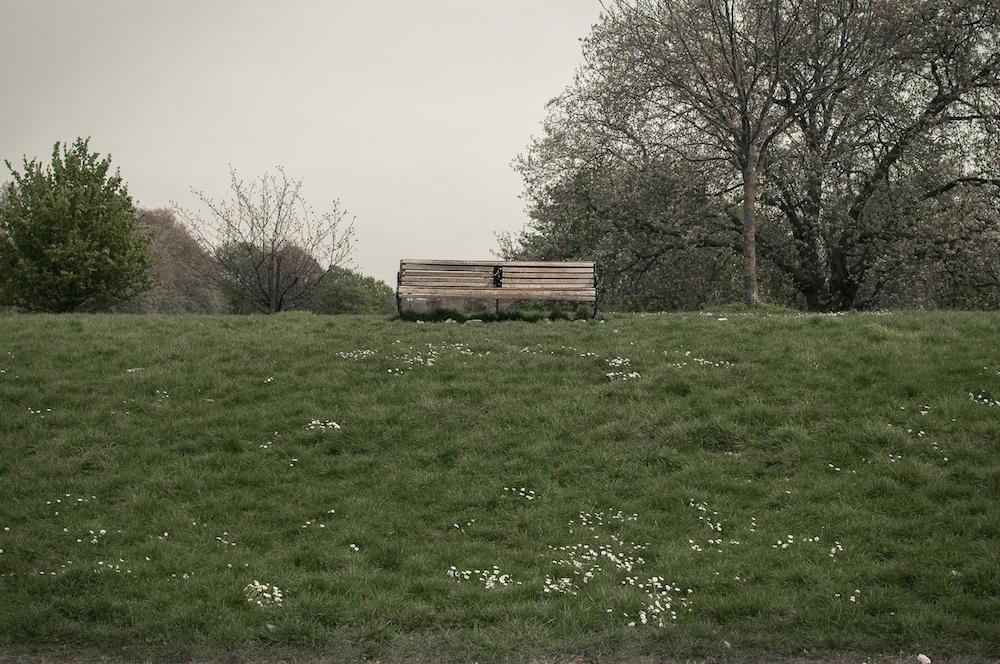

<figure id="attachment_2797" aria-describedby="caption-attachment-2797" style="width: 790px"><figcaption id="caption-attachment-2797">“El banc” – <a href="http://creativecommons.org/licenses/by-nc-nd/3.0/" target="_blank" rel="noopener noreferrer">Lluís Ribes i Portillo (cc)</a></figcaption></figure>

### *“En realidad, esto del amor no tenía ninguna lógica, murmuraba Guille mientras insistía en deshojar la margarita que reiteradamente le decía que no.*

### *Tras el columpio, ella recoge en secreto esos pétalos que no llevan su nombre, y los custodia en su caja de tesoros, a las espera de que tal vez algún día cambien de color, rebroten o se marchiten sin más.*

### *Sentada en un banco, a distancia, la señorita los observa y revisa por enésima vez su teléfono y esboza una triste sonrisa de esperanza.”*

j.m.p.