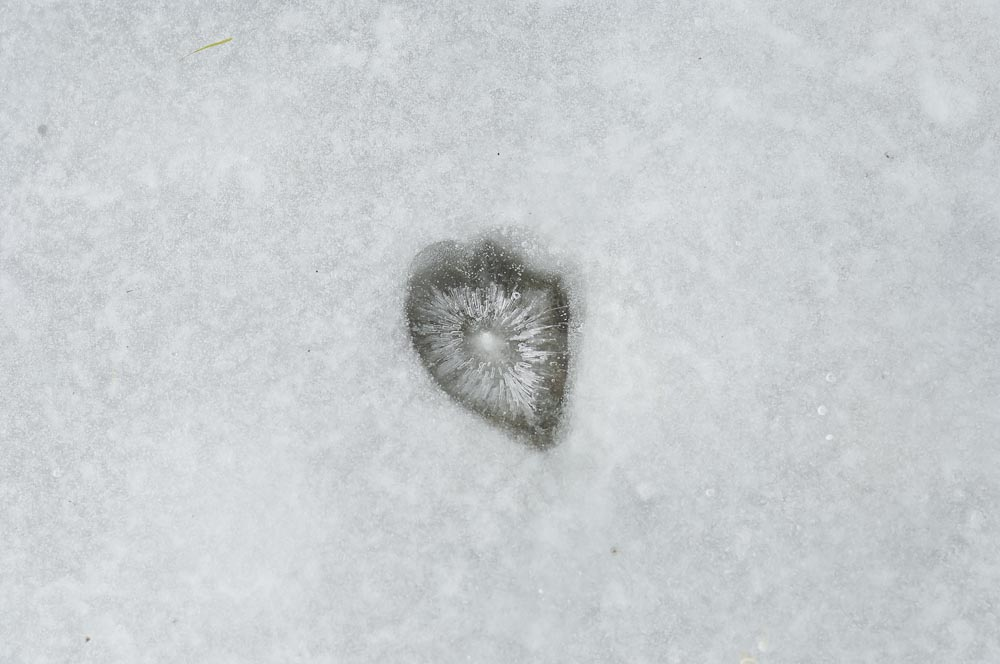

<figure id="attachment_2802" aria-describedby="caption-attachment-2802" style="width: 990px"><figcaption id="caption-attachment-2802">“Amor” – <a href="http://creativecommons.org/licenses/by-nc-nd/3.0/" target="_blank" rel="noopener noreferrer">Lluís Ribes i Portillo (cc)</a></figcaption></figure>

  
 

#### “Amor, portaves al món  
set mil set-cents seixanta-cinc  
dies, en cloure’s la nit  
que em vas cridar del teu racó,  
veu que s’havia compadit  
i em rebies, cos bondadós.  
Quin joc perdut, quin rodar  
fins a trencar un brancam fosc.  
Set mil set-cents seixanta-cinc  
dies, abans no vaig trobar  
on te havies arraulit,  
amor, per créixer lluny de mi.”

[Gabriel Ferrater](http://es.wikipedia.org/wiki/Gabriel_Ferrater)