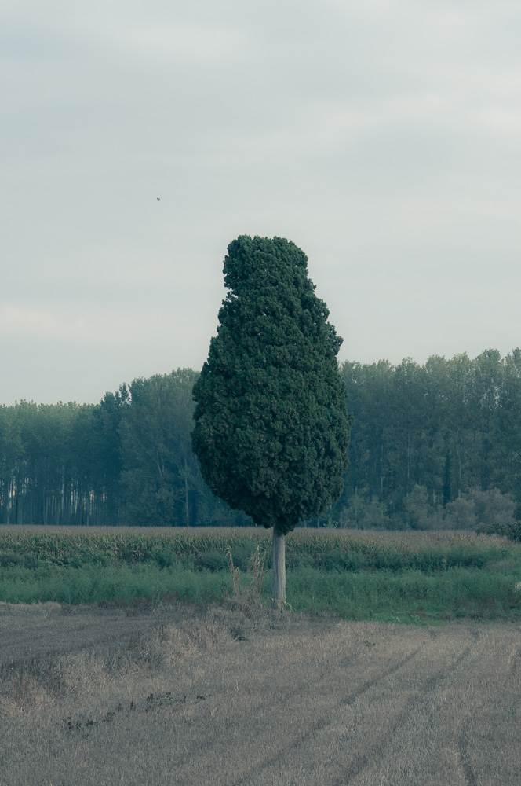

<figure id="attachment_2845" aria-describedby="caption-attachment-2845" style="width: 521px"><figcaption id="caption-attachment-2845">“Ll” – <a href="http://creativecommons.org/licenses/by-nc-nd/3.0/" target="_blank" rel="noopener noreferrer">Lluís Ribes i Portillo (cc)</a></figcaption></figure>

> **\[Pourquoi que je vis…\]**
> 
> *“Pourquoi que je vis*  
> *Pourquoi que je vis*  
> *Pour la jambe jaune*  
> *D’une femme blonde*  
> *Appuyée au mur*  
> *Sous le plein soleil*  
> *Pour la voile ronde*  
> *D’un pointu du port*  
> *Pour l’ombre des stores*  
> *Le café glacé*  
> *Qu’on boit dans un tube*  
> *Pour toucher le sable*  
> *Voir le fond de l’eau*  
> *Qui devient si bleu*  
> *Qui descend si bas*  
> *Avec les poissons*  
> *Les calmes poissons*  
> *Ils paissent le fond*  
> *Volent au-dessus*  
> *Des algues cheveux*  
> *Comme zoizeaux lents*  
> *Comme zoizeaux bleus*  
> *Pourquoi que je vis*  
> *Parce que c’est joli.”*  
> [Boris Vian](http://es.wikipedia.org/wiki/Boris_Vian)
> 
> **\[Por qué vivo …\]**
> 
> *“Por qué vivo*  
> *Por qué vivo*  
> *Por la pierna ámbar*  
> *De una mujer rubia*  
> *Apoyada en la pared*  
> *A pleno sol*  
> *Por la vela redonda*  
> *De un barco picudo del puerto*  
> *Por la sombra de los estores*  
> *El café helado*  
> *Que se bebe en un vaso de tubo*  
> *Por tocar la arena*  
> *Ver el fondo del agua*  
> *Que se vuelve tan azul*  
> *Que baja tan abajo*  
> *Con los peces*  
> *Los tranquilos peces*  
> *Pacen en el fondo*  
> *Vuelan por encima*  
> *De las algas cabellos*  
> *Como pájaros lentos*  
> *Como pájaros azules*  
> *Por qué vivo*  
> *Porque es bonito.”*

[Boris Vian](http://es.wikipedia.org/wiki/Boris_Vian)