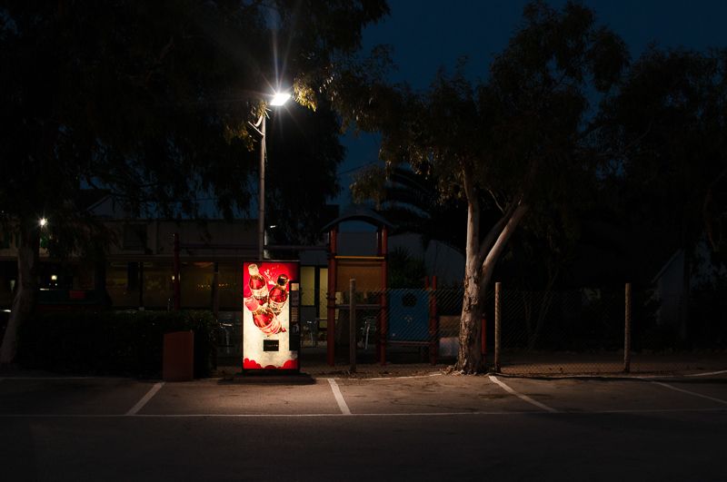
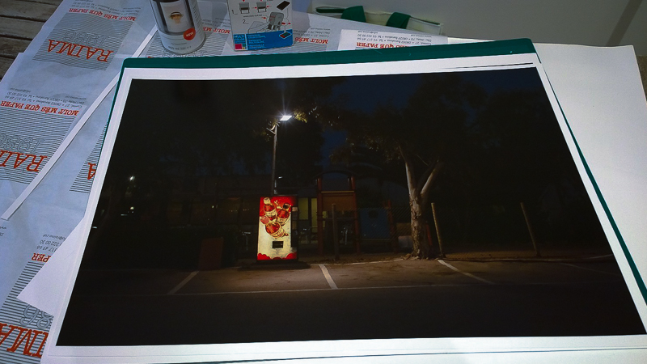

<figure id="attachment_2859" aria-describedby="caption-attachment-2859" style="width: 590px"><figcaption id="caption-attachment-2859">“La màquina de vermell” – <a href="http://creativecommons.org/licenses/by-nc-nd/3.0/" target="_blank" rel="noopener noreferrer">Lluís Ribes i Portillo (cc)</a></figcaption></figure>

  
Abajo la primera copia de “***La màquina de vermell***” tras el secado y el barnizado preparada para ser enmarcada y luego viajar hasta su destino final: [Edimburgo](https://www.google.es/maps/place/Edimburg,+City+of+Edinburgh,+Regne+Unit/@55.9410655,-3.2053836,12z/data=!3m1!4b1!4m2!3m1!1s0x4887b800a5982623:0x64f2147b7ce71727). Una de las impresiones más difíciles de mis fotografías que he tenido que realizar. Sin duda su propietario la disfrutará durante muchos años.  
  
¿Queréis conocer donde está esta máquina tan sexy? … pues es un secreto, y como dijo Astilo en el “*Coloquio de los Centauros*” de [Rubén Darío](http://es.wikipedia.org/wiki/Rub%C3%A9n_Dar%C3%ADo):

“El Enigma es el soplo que hace cantar la lira”
-----------------------------------------------